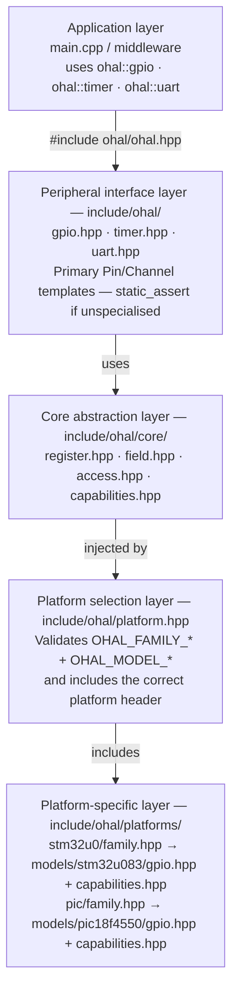
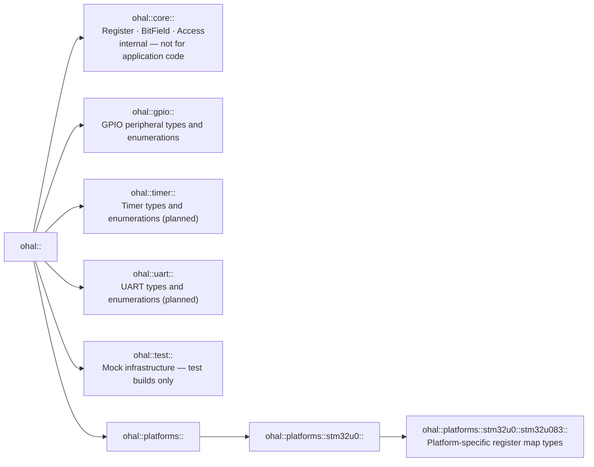

# Architecture overview

This document describes the internal structure of `ohal` for contributors who want to understand
how the layers fit together before adding new MCU support or new peripherals.

## Design goals

| #   | Goal                    | Description                                                                                                       |
| --- | ----------------------- | ----------------------------------------------------------------------------------------------------------------- |
| G1  | Zero RAM                | All configuration is encoded in types and template parameters.                                                    |
| G2  | Zero overhead           | Every HAL operation compiles to the same instruction sequence as a direct `volatile` register write.              |
| G3  | Consistent API          | The same `ohal::gpio` API works on STM32, PIC18, TI MSPM0, and any future platform.                               |
| G4  | Noisy failures          | Using an unsupported feature, or targeting an unimplemented MCU, is a compile error with a descriptive message.   |
| G5  | Strongly typed          | No `uint32_t` magic numbers in application code. Every pin mode, output type, and configuration value is an enum. |
| G6  | Correct-by-construction | Reading a write-only register or writing a read-only register is a compile error.                                 |
| G7  | No address assumptions  | The core layer never hard-codes a register address. Every address is supplied by the platform layer.              |
| G8  | Host-testable           | Register accesses are injectable; the full test suite runs on a development host without hardware.                |
| G9  | C++17 strict            | No compiler extensions, no C++20 features.                                                                        |

## Layer diagram



## Core abstractions

### `Register<Address, T>` — `include/ohal/core/register.hpp`

Models a single memory-mapped hardware register at a compile-time address.

```cpp
template <uintptr_t Address, typename T = uint32_t>
struct Register {
    using value_type = T;
    static T    read()          noexcept;  // single volatile load
    static void write(T value)  noexcept;  // single volatile store
};
```

**Atomicity:** `read()` and `write()` each compile to a single `volatile` bus transaction — the
hardware-guaranteed atomic unit for MMIO. There are intentionally no `set_bits`, `clear_bits`, or
`modify` helpers because those require multiple transactions and are therefore non-atomic with
respect to interrupt handlers. Platform specialisations that need atomic bit manipulation must use
hardware-provided mechanisms such as the STM32 BSRR register.

**Register width:** `T` defaults to `uint32_t` for ARM targets. Use `uint8_t` for 8-bit platforms
such as PIC18.

### `BitField<Reg, Offset, Width, Access, ValueType>` — `include/ohal/core/field.hpp`

Describes a contiguous group of bits within a register.

```cpp
template <typename Reg, uint8_t Offset, uint8_t Width, Access Acc,
          typename ValueType = typename Reg::value_type>
struct BitField {
    static ValueType read()             noexcept;  // masked extract
    static void      write(ValueType v) noexcept;  // masked insert or atomic write
};
```

- `read()` is a compile error when `Acc == WriteOnly`.
- `write()` is a compile error when `Acc == ReadOnly`.
- For `WriteOnly` fields, `write()` emits a single store instruction with no preceding read.
- For `ReadWrite` fields, `write()` is a read-modify-write sequence.
- `Offset + Width` is bounds-checked against `sizeof(T) * 8` at instantiation time.
- Setting `ValueType` to an enum type makes `read()` return the enum directly.

### `Access` — `include/ohal/core/access.hpp`

```cpp
enum class Access : uint8_t { ReadOnly = 0, WriteOnly = 1, ReadWrite = 2 };
```

### Capability traits — `include/ohal/core/capabilities.hpp`

Primary templates that default to `std::false_type`:

```cpp
namespace ohal::gpio::capabilities {
    template <typename Port, uint8_t PinNum>
    struct supports_output_type     : std::false_type {};
    // … supports_output_speed, supports_pull, supports_alternate_function
}
```

Platform headers specialise these to `std::true_type` for every (Port, PinNum) pair that supports
the feature. If a platform header does not specialise a trait, the default `false_type` ensures
that calling the guarded method fires a `static_assert`.

## Peripheral interface pattern

Each peripheral (GPIO, Timer, UART, …) follows the same three-file pattern:

1. **`include/ohal/<peripheral>.hpp`** — generic interface.
   - Defines enumerations (e.g. `PinMode`, `OutputType`).
   - Declares a primary template (e.g. `Pin<Port, PinNum>`) whose body contains only a
     `static_assert` that fires when the template is not specialised.
2. **`include/ohal/platforms/<family>/models/<model>/<peripheral>.hpp`** — register map.
   - Defines register address constants and `GpioPortRegs<Base>` (or equivalent) structs.
   - Provides partial specialisations of the primary template for every supported port.
3. **`include/ohal/platforms/<family>/models/<model>/capabilities.hpp`** — capability traits.
   - Specialises the traits from `ohal/core/capabilities.hpp` to `std::true_type` for features that
     the model supports.

## Platform selection

`include/ohal/platform.hpp` is the gatekeeper. It:

1. Checks that exactly one `OHAL_FAMILY_*` define is present; errors with a clear message if not.
2. `#include`s the matching `platforms/<family>/family.hpp`.

Each `family.hpp`:

1. Checks that exactly one `OHAL_MODEL_*` define belonging to that family is present.
2. `#include`s all model headers for the selected model (gpio, timer, uart, capabilities).

## Namespace conventions



## Error strategy

All error messages are prefixed with `ohal:` so they are easy to identify in build output.

| Error class                    | Mechanism                            | Example                                                             |
| ------------------------------ | ------------------------------------ | ------------------------------------------------------------------- |
| Missing/conflicting MCU define | `#error` preprocessor                | `ohal: No MCU family defined.`                                      |
| Unimplemented peripheral       | `static_assert` in primary template  | `ohal: gpio::Pin is not implemented for the selected MCU.`          |
| Read-only violation            | `static_assert` in `BitField::write` | `ohal: cannot write to a read-only field`                           |
| Write-only violation           | `static_assert` in `BitField::read`  | `ohal: cannot read from a write-only field`                         |
| Field out of bounds            | `static_assert` in `BitField` body   | `ohal: BitField (Offset + Width) exceeds register width`            |
| Unsupported feature            | `static_assert` in platform method   | `ohal: PIC18F4550 GPIO does not support configurable output speed.` |

`static_assert` is preferred over `#error` wherever the check can be expressed as a constant
expression because it produces more context in the compiler output.
