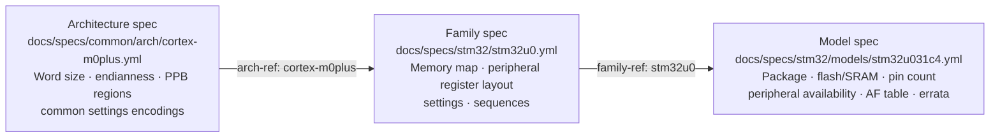
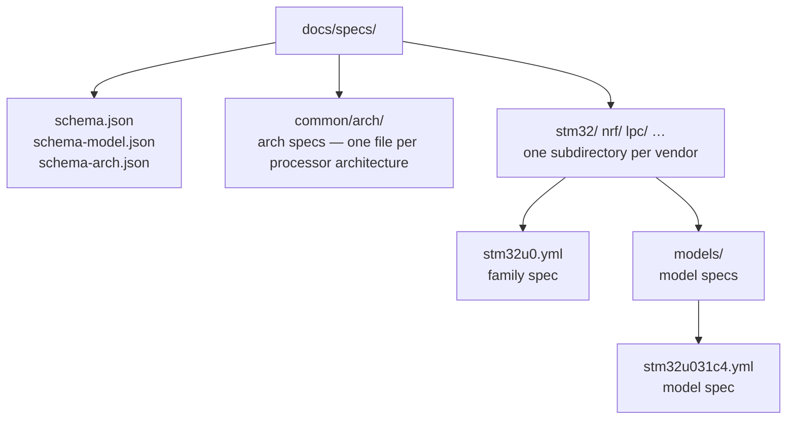

# Device-family register specifications

ohal uses structured YAML specification files to capture the memory map and peripheral
register/field metadata for each supported microcontroller family. These spec files are the
authoritative source of hardware facts — they are validated against JSON Schemas in CI and can be
consumed by code generators to produce platform-specific HAL headers.

This page covers everything a contributor needs to know when creating or extending a spec.

## Why specs exist

The C++ platform headers under `include/ohal/platforms/` encode register addresses and bit-field
layouts. Without a single authoritative source, this data tends to drift from the reference
manual, get duplicated across files, and become hard to audit.

The spec files solve this by capturing register data in a structured, validated, human-readable
format that is separate from the C++ code. A contributor adds (or updates) a spec, and a code
generator (or a careful human) derives the C++ platform header from it.

## The three spec types

There are three distinct spec types, each with its own JSON Schema and directory location:



| Spec type    | Location                                | Schema              | Description                                                               |
| ------------ | --------------------------------------- | ------------------- | ------------------------------------------------------------------------- |
| Architecture | `docs/specs/common/arch/{arch}.yml`     | `schema-arch.json`  | Architecture-level metadata shared by all devices of that architecture    |
| Family       | `docs/specs/{vendor}/{family}.yml`      | `schema.json`       | Device-family register map and peripheral metadata                        |
| Model        | `docs/specs/{vendor}/models/{part}.yml` | `schema-model.json` | Per-part-number details (package, flash/SRAM sizes, pin AF table, errata) |

## Directory layout



**Vendor directory naming:** use the vendor's product-line prefix in lowercase (e.g. `stm32` for
STMicroelectronics STM32, `nrf` for Nordic nRF, `lpc` for NXP LPC).

## Family spec format

Family specs are validated against `docs/specs/schema.json`.

### Required top-level keys

| Key            | Description                                            |
| -------------- | ------------------------------------------------------ |
| `spec-version` | Spec format version using semver (e.g. `"1.0.0"`)      |
| `vendor`       | Chip vendor name (e.g. `STMicroelectronics`)           |
| `family`       | Family `name` and optional `sub-families` list         |
| `architecture` | Processor architecture `name` and optional `word-size` |
| `reference`    | Reference manual `document` and `revision`             |

### Optional top-level keys

| Key           | Description                                                 |
| ------------- | ----------------------------------------------------------- |
| `arch-ref`    | Reference to an architecture spec (e.g. `cortex-m0plus`)    |
| `memory`      | Memory map with address ranges and sub-family applicability |
| `definitions` | Reusable settings blocks (used via YAML anchors, see below) |
| `peripherals` | Peripheral blocks with register and bit-field descriptions  |

### Spec version

Every spec must declare the format version as the first key:

```yaml
spec-version: "1.0.0"
```

The version uses [semantic versioning](https://semver.org/) (`MAJOR.MINOR.PATCH`): increment the
patch for corrections, the minor for backward-compatible additions, and the major for breaking
changes.

### Memory map

Each entry in `memory.map` is a named address range:

```yaml
memory:
  map:
    - name: Main flash memory
      sub-families: [stm32u031]
      start: "0x08000000"
      end: "0x0801FFFF"
    - name: SRAM
      start: "0x20000000"
      end: "0x20002FFF"
```

Optional per-entry keys:

| Key            | Description                                                                                                             |
| -------------- | ----------------------------------------------------------------------------------------------------------------------- |
| `sub-families` | Sub-families for which this region exists. Omit if the region is present in all sub-families.                           |
| `base`         | Peripheral base address for register offset calculations, when it differs from `start`.                                 |
| `verified`     | Set to `false` to flag a region that is provisional or needs checking against the reference manual. Defaults to `true`. |
| `note`         | Free-text annotation.                                                                                                   |

### Peripherals

Peripherals are listed under `peripherals`. Each item is a single-key mapping:

```yaml
peripherals:
  - gpio:
      reference:
        sections: [7.4]
      instances:
        - name: GPIOA
          base: "0x50000000"
        - name: GPIOB
          base: "0x50000400"
          sub-families: [stm32u083]
      registers:
        - MODER:
            reference:
              section: 7.4.1
            offset: "0x00"
            fields:
              - name: MODE15
                msb: 31
                lsb: 30
                width: 2
                access: rw
                settings: *gpio-mode
```

The `instances` list binds the generic register layout to concrete base addresses. Each instance
has a required `name` and `base` (hex string), and an optional `sub-families` list.

### Register fields

Each field has:

| Key             | Type                 | Description                                                                        |
| --------------- | -------------------- | ---------------------------------------------------------------------------------- |
| `name`          | string               | Field name from the reference manual                                               |
| `msb`           | integer              | Most-significant bit position (inclusive, 0-based)                                 |
| `lsb`           | integer              | Least-significant bit position (inclusive, 0-based)                                |
| `width`         | integer              | Field width in bits (must equal `msb - lsb + 1`)                                   |
| `access`        | `rw` \| `ro` \| `wo` | Read/write, read-only, or write-only                                               |
| `note`          | string (optional)    | Free-text annotation                                                               |
| `priority-over` | list (optional)      | Field names in the same register that this field overrides in a simultaneous write |
| `settings`      | mapping or `~`       | Enumerated bit-pattern values (see below)                                          |

### Settings

`settings` is a mapping from binary bit-pattern strings to human-readable descriptions:

```yaml
settings:
  "00": input mode
  "01": general purpose output mode
  "10": alternate function mode
  "11": analogue mode
```

Use `settings: ~` (null) for reserved fields that have no documented settings. Keys **must** be
quoted strings (`"00"`, `"10"`) even though they look numeric — bare numeric keys are silently
misinterpreted by YAML 1.1 parsers.

### Reducing duplication with YAML anchors

When the same settings block repeats across many fields (e.g. all 16 MODE fields in a GPIO mode
register share identical encoding), define the block once under `definitions` using a YAML anchor
and reference it with a YAML alias:

```yaml
definitions:
  settings:
    gpio-mode: &gpio-mode
      "00": input mode
      "01": general purpose output mode
      "10": alternate function mode
      "11": analogue mode

peripherals:
  - gpio:
      registers:
        - MODER:
            fields:
              - name: MODE15
                msb: 31
                lsb: 30
                width: 2
                access: rw
                settings: *gpio-mode
              - name: MODE14
                msb: 29
                lsb: 28
                width: 2
                access: rw
                settings: *gpio-mode
```

`definitions.settings` is a direct mapping (not a list), and all keys must be quoted strings.

### Field write-conflict priority

Some registers contain pairs of fields that represent conflicting operations on the same hardware
bit (e.g. BSRR's BSx / BRx set/reset pairs). Document which field wins with `priority-over`:

```yaml
- name: BS0
  msb: 0
  lsb: 0
  width: 1
  access: wo
  priority-over: [BR0] # BS0's effect wins if both BS0=1 and BR0=1 are written simultaneously
  settings: *bsrr-bs
```

### Register access sequences

Some registers require a specific multi-step access sequence (e.g. the GPIO lock register). Document
these under `sequence`, which is an object with a required `description` and an ordered `steps`
list:

```yaml
- LCKR:
    sequence:
      description: >-
        Lock sequence — must be followed exactly to freeze the port configuration.
        Accepts one caller argument: lock-bits, a 16-bit mask indicating which pins to lock.
      steps:
        - op: write
          note: Write LCKK=1 with the desired lock-bits
          fields:
            LCKK: 1
            LCK: write-arg
        - op: write
          note: Write LCKK=0 with the same lock-bits
          fields:
            LCKK: 0
            LCK: write-arg
        - op: write
          note: Write LCKK=1 again
          fields:
            LCKK: 1
            LCK: write-arg
        - op: read
          note: Read to complete the sequence (result discarded)
        - op: read
          optional: true
          note: Optional — LCKK reads back as 1 when the lock is active
          expect:
            LCKK: 1
```

Each step has a required `op` key (`read` or `write`) and the following optional keys:

| Key        | Applies to | Description                                                                                                   |
| ---------- | ---------- | ------------------------------------------------------------------------------------------------------------- |
| `note`     | any        | Human-readable explanation, including timing or ordering constraints                                          |
| `optional` | any        | If `true`, the step may be omitted. Defaults to `false`                                                       |
| `fields`   | `write`    | Field-name → value mapping. Values are integers (bit pattern) or `"write-arg"` (caller-supplied value)        |
| `expect`   | `read`     | Field-name → expected-value mapping. A mismatch indicates sequence failure. Omit when the result is discarded |

`write-arg` means the caller supplies the value. The sequence `description` must document what each
`write-arg` represents. `fields` must not appear on `read` steps; `expect` must not appear on
`write` steps.

## Architecture spec format

Architecture specs are validated against `docs/specs/schema-arch.json`.

```yaml
spec-version: "1.0.0"
architecture:
  name: ARM Cortex-M0+
  word-size: 32
  endianness: little
memory:
  map:
    - name: Private Peripheral Bus
      start: "0xE0000000"
      end: "0xE00FFFFF"
definitions:
  settings:
    gpio-mode: &gpio-mode
      "00": input mode
      "01": general purpose output mode
      "10": alternate function mode
      "11": analogue mode
```

Because YAML anchors cannot span files, any settings that are defined in an architecture spec and
also used within a family spec (as YAML aliases) must be redefined in the family spec's own
`definitions.settings` block. Annotate the copy with a comment noting that the canonical definition
lives in the architecture spec.

## Model spec format

Device-model specs are validated against `docs/specs/schema-model.json`.

Required top-level keys:

| Key            | Type    | Description                                 |
| -------------- | ------- | ------------------------------------------- |
| `spec-version` | string  | Spec format version (semver)                |
| `vendor`       | string  | Must match the parent family spec           |
| `family-ref`   | string  | Family spec identifier (e.g. `stm32u0`)     |
| `model`        | string  | Part number identifier (e.g. `stm32u031c4`) |
| `package`      | string  | Package code (e.g. `UFQFPN32`, `LQFP48`)    |
| `flash-kb`     | integer | On-chip flash in kibibytes                  |
| `sram-kb`      | integer | On-chip SRAM in kibibytes                   |
| `pin-count`    | integer | Number of physical pins                     |

Optional keys:

| Key                       | Description                                                 |
| ------------------------- | ----------------------------------------------------------- |
| `peripheral-availability` | Which peripheral instances from the family spec are present |
| `alternate-functions`     | Per-pin AF mapping table (AF0–AF15 → signal names)          |
| `errata`                  | Known hardware errata with silicon-revision applicability   |

Minimal example:

```yaml
spec-version: "1.0.0"
vendor: STMicroelectronics
family-ref: stm32u0
model: stm32u031c4
package: UFQFPN32
flash-kb: 256
sram-kb: 12
pin-count: 32
peripheral-availability:
  - peripheral: gpio
    instances: [GPIOA, GPIOB, GPIOC, GPIOD, GPIOF]
```

## Validation

Specs are validated in CI by `lint.sh` using `check-jsonschema`. To validate locally:

```sh
pip install check-jsonschema

# Family spec
check-jsonschema --schemafile docs/specs/schema.json docs/specs/stm32/stm32u0.yml

# Model spec
check-jsonschema --schemafile docs/specs/schema-model.json docs/specs/stm32/models/stm32u031c4.yml

# Architecture spec
check-jsonschema --schemafile docs/specs/schema-arch.json docs/specs/common/arch/cortex-m0plus.yml
```

All spec YAML files are also checked by Prettier (`npx prettier --check`). Run `npx prettier --write`
on any spec file you edit before committing.

## Creating a new spec checklist

### New architecture spec

- [ ] Create `docs/specs/common/arch/{arch}.yml`.
- [ ] Set `spec-version`, `architecture` (name, word-size, endianness), `memory.map` for PPB regions.
- [ ] Define common `settings` blocks under `definitions.settings`.
- [ ] Validate: `check-jsonschema --schemafile docs/specs/schema-arch.json docs/specs/common/arch/{arch}.yml`.

### New family spec

- [ ] Create `docs/specs/{vendor}/{family}.yml`.
- [ ] Populate all required top-level keys (`spec-version`, `vendor`, `family`, `architecture`, `reference`).
- [ ] Add `arch-ref` if the family belongs to a well-known architecture.
- [ ] Define shared settings blocks under `definitions.settings` (repeat any aliases needed from the architecture spec).
- [ ] Document `memory.map` — every named region with `start`/`end` in hex strings.
- [ ] Document every peripheral: `instances` list, all registers, all fields (`name`, `msb`, `lsb`, `width`, `access`, `settings`).
- [ ] Use `priority-over` for any BSRR-style conflicting-write field pairs.
- [ ] Use `sequence` for any registers with mandatory multi-step access procedures.
- [ ] Mark provisional entries with `verified: false`.
- [ ] Validate: `check-jsonschema --schemafile docs/specs/schema.json docs/specs/{vendor}/{family}.yml`.
- [ ] Run `npx prettier --write docs/specs/{vendor}/{family}.yml`.

### New model spec

- [ ] Create `docs/specs/{vendor}/models/{part-number}.yml`.
- [ ] Set all required keys (`spec-version`, `vendor`, `family-ref`, `model`, `package`, `flash-kb`, `sram-kb`, `pin-count`).
- [ ] Add `peripheral-availability` if the model does not expose all peripheral instances from the family spec.
- [ ] Add `alternate-functions` table if pin-AF data is available.
- [ ] Validate: `check-jsonschema --schemafile docs/specs/schema-model.json docs/specs/{vendor}/models/{part-number}.yml`.
- [ ] Run `npx prettier --write docs/specs/{vendor}/models/{part-number}.yml`.
