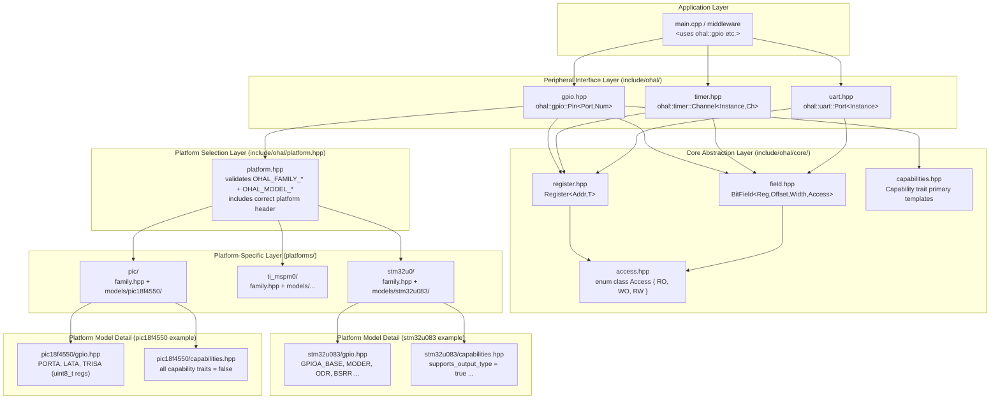
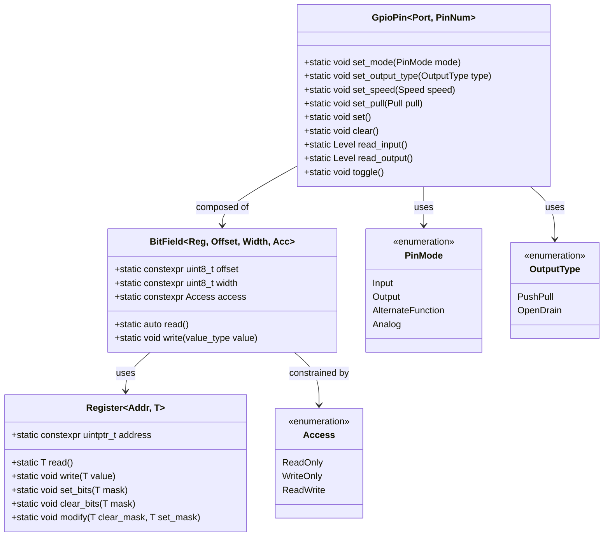
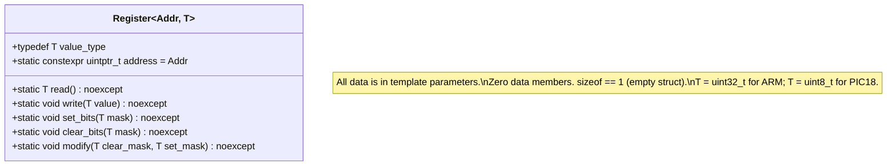
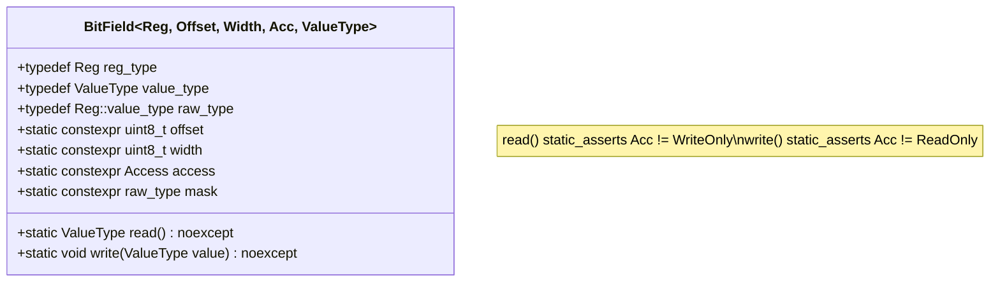
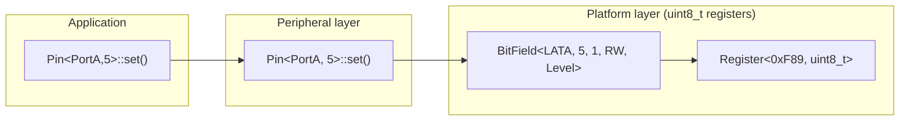
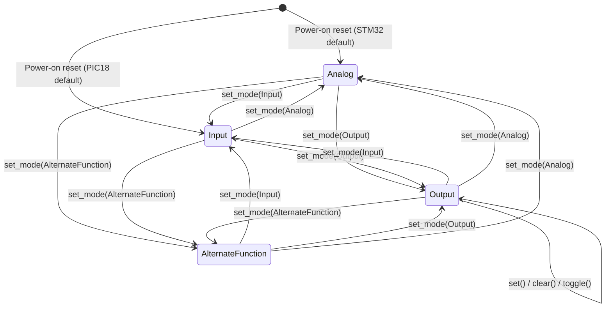
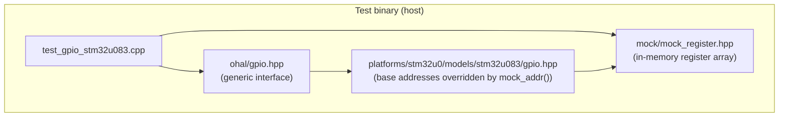
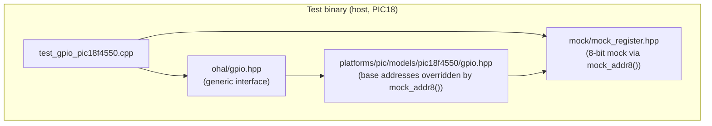

# OHAL – Zero Overhead Open HAL: Development Plan

## Table of Contents

1. [Design Goals](#1-design-goals)
2. [Guiding Principles](#2-guiding-principles)
3. [Architecture Overview](#3-architecture-overview)
4. [Repository Layout](#4-repository-layout)
5. [Stepwise Development Plan](#5-stepwise-development-plan)
6. [Detailed Design: Core Abstractions](#6-detailed-design-core-abstractions)
7. [Detailed Design: MCU Selection](#7-detailed-design-mcu-selection)
8. [Detailed Design: Peripheral Interface (GPIO)](#8-detailed-design-peripheral-interface-gpio)
9. [Detailed Design: Unit Testing Strategy](#9-detailed-design-unit-testing-strategy)
10. [Detailed Design: Error Strategy](#10-detailed-design-error-strategy)
11. [Namespace Convention](#11-namespace-convention)
12. [Consumer Usage Examples](#12-consumer-usage-examples)
13. [Open Questions and Future Work](#13-open-questions-and-future-work)

---

## 1. Design Goals

| # | Goal | Notes |
|---|------|-------|
| G1 | **Zero RAM at runtime** | All peripheral configuration is encoded in types and template parameters; no global or heap-allocated state is needed for the HAL itself. |
| G2 | **Register-write efficiency** | Every HAL operation must compile to the same instruction sequence as a hand-written `volatile` register access. Verified by inspecting generated assembly and zero-cost abstraction guarantees. |
| G3 | **Consistent API across MCU families** | The same `ohal::gpio` API works on STM32, TI MSP-M0, Microchip PIC18, and any future platform with no changes to application code. |
| G4 | **Noisy compile-time failures** | If an application targets a peripheral feature that is not supported by the selected MCU, compilation fails with a human-readable `static_assert` message. |
| G5 | **Strongly typed** | Registers, bit fields, peripheral instances, pin modes, and all configuration values are distinct types — no `uint32_t` magic numbers in application code. |
| G6 | **Correct-by-construction** | Writing to a read-only register/field is a compile error. Reading from a write-only register/field is a compile error. |
| G7 | **No memory-map assumptions** | The HAL core layer makes no assumptions about register addresses. Every address is provided by the platform-specific layer. If a step requires register details, those details are listed explicitly (family, model, peripheral, register map). |
| G8 | **Unit testable on host and target** | The register abstraction layer is injectable; tests can run the same test cases on a development host (with simulated registers) and on the real target. |
| G9 | **C++17 strict** | No compiler extensions, no C++20 features. |
| G10 | **Consistent namespace** | All public symbols live inside `ohal::`. Peripheral types are in sub-namespaces: `ohal::gpio`, `ohal::timer`, `ohal::uart`. |
| G11 | **Minimal consumer imports** | Consumers write `using namespace ohal::gpio;` and nothing more (beyond including the single top-level header). |
| G12 | **MCU selection via compiler defines** | `-DOHAL_FAMILY_STM32U0` and `-DOHAL_MODEL_STM32U083`. Invalid or missing define combinations fail at compile time. |

---

## 2. Guiding Principles

### 2.1 Everything at Compile Time

The HAL is a collection of **type-level** descriptions of hardware. A "GPIO port A, pin 5" is a
type, not a runtime variable. Calling `set()` on that type emits a single store instruction (or
equivalent) and nothing else. No vtables, no virtual dispatch, no heap allocation, no dynamic
branching.

### 2.2 Platform-Specific Code is Isolated

Application code (`main.cpp`, middleware) only ever sees the generic `ohal` interface headers.
Platform-specific register maps and capability tables live entirely inside `ohal/platforms/`. The
build system injects the correct platform directory into the include path via the MCU defines.

### 2.3 Capabilities are Modelled, Not Guarded at Runtime

If a GPIO pin does not support open-drain output on the chosen MCU, there is no runtime branch
that returns an error code. Instead, instantiating the open-drain configuration for that pin does
not compile. The capability model is expressed as template specialisation: if no specialisation
exists for a given (peripheral, feature) pair, the primary template raises a `static_assert`.

### 2.4 Tests Drive Design

Every abstraction layer in Steps 2–5 has a corresponding host-side test written using only C++
standard library facilities (no OS, no hardware). This ensures the abstraction is testable in
isolation, confirms the zero-overhead goal by inspecting compiler output, and catches regressions
early.

---

## 3. Architecture Overview

### 3.1 Layer Diagram



### 3.2 Class / Type Diagram



### 3.3 MCU Selection Flow


---

## 4. Repository Layout

```
ohal/
├── .github/
│   └── workflows/
│       ├── ci.yml                       ← host build, cross-compile, static analysis
│       ├── conventional-commits.yml     ← PR title validation (Step 11)
│       └── release-please.yml           ← automated versioning and changelog (Step 11)
├── cmake/
│   └── ohal-config.cmake.in             ← CMake package config template (Step 12)
├── docs/
│   ├── plan.md                          ← this index document
│   └── steps/
│       ├── step-01-build-infrastructure.md
│       ├── step-02-register-abstraction.md
│       ├── step-03-bitfield-access-control.md
│       ├── step-04-mcu-selection.md
│       ├── step-05-gpio-interface.md
│       ├── step-06-stm32u0-gpio.md
│       ├── step-07-timer-uart.md
│       ├── step-08-pic18f4550-gpio.md   ← non-ARM concrete implementation
│       ├── step-09-unit-testing.md
│       ├── step-10-ci.md
│       ├── step-11-release-automation.md ← conventional commits, merge queue, release-please
│       ├── step-12-vcpkg-package.md
│       ├── step-13-additional-mcu-families.md
│       └── step-14-additional-peripherals.md
├── include/
│   └── ohal/
│       ├── ohal.hpp                     ← single top-level include for consumers
│       ├── platform.hpp                 ← MCU selection and validation
│       ├── core/
│       │   ├── register.hpp             ← Register<Addr, T> template
│       │   ├── field.hpp                ← BitField<Reg, Offset, Width, Access> template
│       │   ├── access.hpp               ← Access enum class
│       │   └── capabilities.hpp         ← Capability trait primary templates
│       ├── gpio.hpp                     ← ohal::gpio peripheral interface
│       ├── timer.hpp                    ← ohal::timer peripheral interface
│       ├── uart.hpp                     ← ohal::uart peripheral interface
│       ├── spi.hpp                      ← ohal::spi peripheral interface (Step 14)
│       ├── i2c.hpp                      ← ohal::i2c peripheral interface (Step 14)
│       ├── adc.hpp                      ← ohal::adc peripheral interface (Step 14)
│       ├── dac.hpp                      ← ohal::dac peripheral interface (Step 14)
│       ├── dma.hpp                      ← ohal::dma peripheral interface (Step 14)
│       ├── clock.hpp                    ← ohal::clock peripheral interface (Step 14)
│       ├── power.hpp                    ← ohal::power peripheral interface (Step 14)
│       └── mpu.hpp                      ← ohal::mpu peripheral interface (Step 14)
├── platforms/
│   ├── stm32u0/
│   │   ├── family.hpp                   ← STM32U0 family header (validates model)
│   │   └── models/
│   │       └── stm32u083/
│   │           ├── gpio.hpp             ← STM32U083 GPIO register map
│   │           ├── timer.hpp            ← STM32U083 Timer register map
│   │           ├── uart.hpp             ← STM32U083 UART/USART register map
│   │           ├── spi.hpp              ← STM32U083 SPI register map (Step 14)
│   │           ├── i2c.hpp              ← STM32U083 I2C register map (Step 14)
│   │           ├── adc.hpp              ← STM32U083 ADC register map (Step 14)
│   │           ├── dac.hpp              ← STM32U083 DAC register map (Step 14)
│   │           ├── dma.hpp              ← STM32U083 DMA register map (Step 14)
│   │           ├── clock.hpp            ← STM32U083 RCC register map (Step 14)
│   │           ├── power.hpp            ← STM32U083 PWR register map (Step 14)
│   │           └── capabilities.hpp     ← STM32U083 peripheral capability traits
│   ├── ti_mspm0/                        ← added in Step 13
│   │   ├── family.hpp
│   │   └── models/
│   │       └── mspm0g3507/
│   │           ├── gpio.hpp
│   │           └── capabilities.hpp
│   └── pic/
│       ├── family.hpp
│       └── models/
│           └── pic18f4550/              ← non-ARM concrete implementation (Step 8)
│               ├── gpio.hpp
│               └── capabilities.hpp
├── ports/
│   └── ohal/                            ← vcpkg overlay port (Step 12)
│       ├── portfile.cmake
│       └── vcpkg.json
├── tests/
│   ├── host/
│   │   ├── CMakeLists.txt
│   │   ├── test_register.cpp            ← tests for Register<> and BitField<>
│   │   ├── test_gpio_stm32u083.cpp      ← STM32U083 GPIO tests with mock registers
│   │   ├── test_gpio_pic18f4550.cpp     ← PIC18F4550 GPIO tests with 8-bit mock registers
│   │   └── mock/
│   │       └── mock_register.hpp        ← in-memory mock of volatile register access
│   ├── integration/                     ← vcpkg find_package integration test (Step 12)
│   │   ├── CMakeLists.txt
│   │   ├── vcpkg.json
│   │   ├── blink_stm32.cpp
│   │   └── blink_pic18.cpp
│   └── target/
│       ├── stm32u083/
│       │   └── test_gpio_stm32u083.cpp
│       └── pic18f4550/
│           └── test_gpio_pic18f4550.cpp
├── CMakeLists.txt
├── release-please-config.json           ← release-please configuration (Step 11)
├── .release-please-manifest.json        ← current version tracking (Step 11)
├── vcpkg.json                           ← vcpkg manifest for consumers (Step 12)
├── CHANGELOG.md                         ← generated by release-please (Step 11)
└── README.md
```

---

## 5. Stepwise Development Plan

Each step is documented in its own file. The sequence is designed so that each step's
prerequisites are completed before it begins.

```mermaid
graph LR
    S1[1. Build Infra] --> S2[2. Register]
    S2 --> S3[3. BitField]
    S3 --> S4[4. MCU Selection]
    S4 --> S5[5. GPIO Interface]
    S5 --> S6[6. STM32U0 GPIO]
    S6 --> S7[7. Timer / UART]
    S7 --> S8[8. PIC18 GPIO]
    S8 --> S9[9. Unit Tests]
    S9 --> S10[10. CI]
    S10 --> S11[11. Release Automation]
    S11 --> S12[12. vcpkg]
    S11 --> S13[13. More MCUs]
    S12 --> S13
    S13 --> S14[14. More Peripherals]
    S12 --> S14
```



Steps 11 and 12 (release automation and packaging) are deliberately placed *before* the
expansion steps (13 and 14) so that:

- Conventional commits and the merge queue are enforced on every new MCU / peripheral PR.
- `release-please` is already configured to bump `vcpkg.json` versions before anyone starts
  consuming the package from new releases.
- Contributors adding new families (Step 13) or new peripherals (Step 14) can immediately open
  PRs that flow through the full release pipeline.

| Step | File | Phase | Key Prerequisite |
|------|------|-------|------------------|
| 1 | [Build Infrastructure](steps/step-01-build-infrastructure.md) | Core | None |
| 2 | [Core Register Abstraction](steps/step-02-register-abstraction.md) | Core | Step 1 |
| 3 | [BitField and Access Control](steps/step-03-bitfield-access-control.md) | Core | Step 2 |
| 4 | [MCU Family/Model Selection](steps/step-04-mcu-selection.md) | First platform | Step 3 |
| 5 | [GPIO Peripheral Interface](steps/step-05-gpio-interface.md) | First platform | Step 4 |
| 6 | [STM32U0 GPIO Implementation](steps/step-06-stm32u0-gpio.md) | First platform | Step 5 |
| 7 | [Timer and UART Peripherals](steps/step-07-timer-uart.md) | First platform | Step 6 |
| 8 | [PIC18F4550 GPIO (non-ARM)](steps/step-08-pic18f4550-gpio.md) | Second platform | Step 5 |
| 9 | [Host and Target Unit Testing](steps/step-09-unit-testing.md) | Validation | Steps 6–8 |
| 10 | [CI / Continuous Integration](steps/step-10-ci.md) | Validation | Step 9 |
| 11 | [Release Automation](steps/step-11-release-automation.md) | Release pipeline | Step 10 |
| 12 | [vcpkg Package](steps/step-12-vcpkg-package.md) | Release pipeline | Step 11 |
| 13 | [Additional MCU Families and Models](steps/step-13-additional-mcu-families.md) | Expansion | Steps 11–12 |
| 14 | [Additional Peripherals](steps/step-14-additional-peripherals.md) | Expansion | Steps 11–13 |

---

## 6. Detailed Design: Core Abstractions

### 6.1 Register Template



### 6.2 BitField Template



### 6.3 Type Relationships (STM32U083 example)


### 6.4 Type Relationships (PIC18F4550 example)



---

## 7. Detailed Design: MCU Selection

### 7.1 Define Combinations

| `OHAL_FAMILY_*` | `OHAL_MODEL_*` | Result |
|---|---|---|
| (none) | (any) | Compile error: "No MCU family defined" |
| `STM32U0` | (none) | Compile error: "No STM32U0 model defined" |
| `STM32U0` | `STM32U083` | OK |
| `STM32U0` | `PIC18F4550` | Compile error: "Model PIC18F4550 is not in family STM32U0" |
| `PIC` | `PIC18F4550` | OK |
| `PIC` | (none) | Compile error: "No PIC model defined" |
| `TI_MSPM0` | `MSPM0G3507` | OK (once implemented) |
| `TI_MSPM0` | (none) | Compile error: "No TI_MSPM0 model defined" |

### 7.2 How to Add a New MCU Family

1. Create `platforms/<new_family>/family.hpp` — list all supported models, include model headers.
2. Create `platforms/<new_family>/models/<model>/gpio.hpp` (and `timer.hpp`, `uart.hpp`).
3. Create `platforms/<new_family>/models/<model>/capabilities.hpp` — specialise capability traits.
4. Add the family to `platform.hpp`'s `#if … #elif` chain.
5. Add the model to `family.hpp`'s model validation.
6. Write host tests (mock register addresses, including 8-bit slots if needed).
7. Add cross-compile check to CI.

No changes to `include/ohal/gpio.hpp` (or any other peripheral interface header) are required.

---

## 8. Detailed Design: Peripheral Interface (GPIO)

### 8.1 GPIO Pin State Machine



### 8.2 GPIO Configuration Sequence (STM32U083)

```mermaid
sequenceDiagram
    participant App
    participant Pin as Pin&lt;PortA, 5&gt;
    participant MODER as GPIOA MODER reg
    participant OTYPER as GPIOA OTYPER reg
    participant BSRR as GPIOA BSRR reg

    App->>Pin: configure as push-pull output, initially high
    Pin->>OTYPER: write(OutputType::PushPull) [bit 5 = 0]
    Pin->>MODER: write(PinMode::Output) [bits 11:10 = 01]
    Pin->>BSRR: write(1 << 5) [set bit 5]
    Note over BSRR: Pin is now HIGH
```

### 8.3 GPIO Configuration Sequence (PIC18F4550)

```mermaid
sequenceDiagram
    participant App
    participant Pin as Pin&lt;PortA, 2&gt;
    participant TRISA as TRISA reg (uint8_t)
    participant LATA as LATA reg (uint8_t)

    App->>Pin: configure as output, initially high
    Pin->>TRISA: clear_bits(1 << 2) [TRIS=0 means output]
    Pin->>LATA: set_bits(1 << 2)
    Note over LATA: Pin is now HIGH
```

---

## 9. Detailed Design: Unit Testing Strategy

### 9.1 Host Test Architecture





See [Step 9](steps/step-09-unit-testing.md) for the full mock infrastructure, target testing
approach, negative-compile test helper, and coverage targets.

---

## 10. Detailed Design: Error Strategy

### 10.1 Classes of Error

| Class | Mechanism | Example message |
|---|---|---|
| No MCU defined | `#error` preprocessor directive | `ohal: No MCU family defined. Pass -DOHAL_FAMILY_STM32U0 (or another family) to the compiler.` |
| Wrong model for family | `#error` preprocessor directive | `ohal: Model PIC18F4550 is not part of family STM32U0. Check -DOHAL_MODEL_*.` |
| Unimplemented peripheral | `static_assert` in primary template | `ohal: gpio::Pin is not implemented for the selected MCU. Ensure -DOHAL_FAMILY_* and -DOHAL_MODEL_* are set correctly.` |
| Write to read-only field | `static_assert` in `BitField::write` | `ohal: cannot write to a read-only field` |
| Read from write-only field | `static_assert` in `BitField::read` | `ohal: cannot read from a write-only field` |
| BitField overflow | `static_assert` in `BitField` body | `ohal: BitField (Offset + Width) exceeds register width` |
| Out-of-range pin number | `static_assert` in platform specialisation | `ohal: STM32U083 GPIOA has pins 0-15 only.` |
| Unsupported feature | `static_assert` in platform specialisation | `ohal: PIC18F4550 GPIO does not support configurable output speed.` |

### 10.2 Error Design Principles

- All error messages are prefixed with `ohal:` for easy grep-ability.
- Messages are written in plain English and indicate both what went wrong and how to fix it.
- `static_assert` is preferred over `#error` wherever the check can be expressed as a constant
  expression (because `static_assert` provides more context in the compiler output).
- `#error` is used only in the platform selection headers where no types exist yet.

---

## 11. Namespace Convention

```
ohal::               ← top-level namespace; platform selection lives here
ohal::core::         ← Register<>, BitField<>, Access enum — not for direct use by consumers
ohal::gpio::         ← GPIO peripheral types and enumerations
ohal::timer::        ← Timer peripheral types and enumerations
ohal::uart::         ← UART peripheral types and enumerations
ohal::spi::          ← SPI peripheral types and enumerations (Step 14)
ohal::i2c::          ← I2C peripheral types and enumerations (Step 14)
ohal::adc::          ← ADC peripheral types and enumerations (Step 14)
ohal::dac::          ← DAC peripheral types and enumerations (Step 14)
ohal::dma::          ← DMA stream types and enumerations (Step 14)
ohal::clock::        ← Clock enable/disable peripheral abstraction (Step 14)
ohal::power::        ← Power and sleep mode types (Step 14)
ohal::mpu::          ← MPU region types (Step 14, Cortex-M only)
ohal::test::         ← Mock infrastructure; only compiled in test builds
```

Consumers use:
```cpp
#include <ohal/ohal.hpp>    // single include
using namespace ohal::gpio;

using Led = Pin<PortA, 5>;
Led::set_mode(PinMode::Output);
Led::set();
```

---

## 12. Consumer Usage Examples

### 12.1 Blink an LED (STM32U083, PA5)

```cpp
// Compile with: -DOHAL_FAMILY_STM32U0 -DOHAL_MODEL_STM32U083 -std=c++17

#include <ohal/ohal.hpp>

using namespace ohal::gpio;

using Led = Pin<PortA, 5>;

int main() {
    Led::set_mode(PinMode::Output);
    Led::set_output_type(OutputType::PushPull);
    Led::set_speed(Speed::Low);
    Led::set_pull(Pull::None);
    Led::set();

    while (true) {
        Led::toggle();
        // some delay ...
    }
}
```

### 12.2 Blink an LED (PIC18F4550, RA2) — non-ARM

```cpp
// Compile with: -DOHAL_FAMILY_PIC -DOHAL_MODEL_PIC18F4550 -std=c++17

#include <ohal/ohal.hpp>

using namespace ohal::gpio;

using Led = Pin<PortA, 2>;

int main() {
    Led::set_mode(PinMode::Output);
    Led::set();

    while (true) {
        Led::toggle();
        // some delay ...
    }
}
```

### 12.3 Unsupported Feature Compile Error (PIC18F4550)

```cpp
// Compile with: -DOHAL_FAMILY_PIC -DOHAL_MODEL_PIC18F4550
#include <ohal/ohal.hpp>

using namespace ohal::gpio;

int main() {
    Pin<PortA, 2>::set_speed(Speed::High);
    // → static_assert failure:
    //   "ohal: PIC18F4550 GPIO does not support configurable output speed."
}
```

### 12.4 Read a Button (STM32U083, PC13)

```cpp
#include <ohal/ohal.hpp>

using namespace ohal::gpio;

using Button = Pin<PortC, 13>;

int main() {
    Button::set_mode(PinMode::Input);
    Button::set_pull(Pull::Up);

    if (Button::read_input() == Level::Low) {
        // button pressed (active low)
    }
}
```

### 12.5 Missing MCU Define

```cpp
// Compiled with no -DOHAL_FAMILY_* define:
#include <ohal/ohal.hpp>
// → #error: "ohal: No MCU family defined.
//            Pass -DOHAL_FAMILY_STM32U0 (or another family) to the compiler."
```

---

## 13. Open Questions and Future Work

| Topic | Question / Action |
|---|---|
| Clock enabling enforcement | `clock::Enable<>` is designed in [Step 14](steps/step-14-additional-peripherals.md) and enables peripheral bus clocks. The open question is whether OHAL should enforce at compile time that `clock::Enable<P>::enable()` has been called before any register in peripheral `P` is accessed — e.g. via a wrapper type or tag parameter. |
| Alternate Function mapping | Setting AF mode requires knowing which AF number maps to which peripheral on each pin. Needs a per-model AF map table (constexpr array or template traits). |
| Interrupt / EXTI | GPIO interrupt configuration involves EXTI registers outside the GPIO block. Needs a separate `ohal::exti` abstraction. |
| Atomic register access | On multi-core MCUs (e.g., STM32H7 dual-core) register access may need memory barriers or hardware semaphores. The `Register<>` template could be extended with an `Ordering` template parameter. |
| C++20 concepts | Once C++20 is permitted, `requires` clauses can replace `static_assert` chains for cleaner error messages. |
| PIC18 PORTB weak pull-ups | PORTB has weak pull-up control via `RBPU` in `INTCON2`. This is not per-pin and lives outside the GPIO peripheral — consider a separate `ohal::pull` abstraction. |
| DMA runtime memory addresses | DMA is the one deliberate exception to the zero-runtime-data principle (see [Step 14](steps/step-14-additional-peripherals.md)). The design decision (NTTP peripheral address, runtime buffer pointer) should be reviewed once DMA is implemented. |
| TI MSP-M0 | MSP-M0 GPIO uses 32-bit registers with a different layout from STM32. Register maps and capability traits must be gathered from the MSPM0G3507 Technical Reference Manual before implementation (Step 13). |
| Code size tracking | A CI job should build a minimal blink example for each supported target and check that the resulting binary size does not regress. This guards the zero-overhead guarantee. |
