# OHAL – Zero Overhead Open HAL: Development Plan

## Table of Contents

1. [Design Goals](#1-design-goals)
2. [Guiding Principles](#2-guiding-principles)
3. [Architecture Overview](#3-architecture-overview)
4. [Repository Layout](#4-repository-layout)
5. [Stepwise Development Plan](#5-stepwise-development-plan)
6. [Detailed Design: Core Abstractions](#6-detailed-design-core-abstractions)
7. [Detailed Design: MCU Selection](#7-detailed-design-mcu-selection)
8. [Detailed Design: Peripheral Interface (GPIO)](#8-detailed-design-peripheral-interface-gpio)
9. [Detailed Design: Unit Testing Strategy](#9-detailed-design-unit-testing-strategy)
10. [Detailed Design: Error Strategy](#10-detailed-design-error-strategy)
11. [Namespace Convention](#11-namespace-convention)
12. [Consumer Usage Examples](#12-consumer-usage-examples)
13. [Open Questions and Future Work](#13-open-questions-and-future-work)

---

## 1. Design Goals

| #   | Goal                                             | Notes                                                                                                                                                                                                                                                                          |
| --- | ------------------------------------------------ | ------------------------------------------------------------------------------------------------------------------------------------------------------------------------------------------------------------------------------------------------------------------------------ |
| G1  | **Zero RAM at runtime**                          | All peripheral configuration is encoded in types and template parameters; no global or heap-allocated state is needed for the HAL itself.                                                                                                                                      |
| G2  | **Register-write efficiency**                    | Every HAL operation must compile to the same instruction sequence as a hand-written `volatile` register access. Verified by inspecting generated assembly and zero-cost abstraction guarantees.                                                                                |
| G3  | **Consistent API across MCU families**           | The same `ohal::gpio` API works on STM32, TI MSP430, and any future platform with no changes to application code.                                                                                                                                                              |
| G4  | **Noisy compile-time failures**                  | If an application targets a peripheral feature that is not supported by the selected MCU, compilation fails with a human-readable `static_assert` message.                                                                                                                     |
| G5  | **Strongly typed**                               | Registers, bit fields, peripheral instances, pin modes, and all configuration values are distinct types — no `uint32_t` magic numbers in application code.                                                                                                                     |
| G6  | **Correct-by-construction**                      | Writing to a read-only register/field is a compile error. Reading from a write-only register/field is a compile error.                                                                                                                                                         |
| G7  | **No memory-map assumptions**                    | The HAL core layer makes no assumptions about register addresses. Every address is provided by the platform-specific layer. If a step requires register details, those details are listed explicitly (family, model, peripheral, register map).                                |
| G8  | **Unit testable on host and target**             | The register abstraction layer is injectable; tests can run the same test cases on a development host (with simulated registers) and on the real target.                                                                                                                       |
| G9  | **C++17 strict**                                 | No compiler extensions, no C++20 features.                                                                                                                                                                                                                                     |
| G10 | **Consistent namespace**                         | All public symbols live inside `ohal::`. Peripheral types are in sub-namespaces: `ohal::gpio`, `ohal::timer`, `ohal::uart`.                                                                                                                                                    |
| G11 | **Minimal consumer imports**                     | Consumers write `using namespace ohal::gpio;` and nothing more (beyond including the single top-level header).                                                                                                                                                                 |
| G12 | **MCU selection via compiler defines**           | `-DOHAL_FAMILY_STM32U0` and `-DOHAL_MODEL_STM32U083` (or `-DOHAL_FAMILY_MSP430FR2XX` and `-DOHAL_MODEL_MSP430FR2355`). Invalid or missing define combinations fail at compile time.                                                                                            |
| G13 | **Multi-pin atomic operations at the HAL level** | `Port<PortTag>` provides `set()`, `clear()`, and `write()` across multiple pins on the same port. Where the hardware supports it (e.g. STM32 BSRR), `write()` compiles to a single store instruction. Application code never reaches into platform namespaces to achieve this. |

---

## 2. Guiding Principles

### 2.1 Everything at Compile Time

The HAL is a collection of **type-level** descriptions of hardware. A "GPIO port A, pin 5" is a
type, not a runtime variable. Calling `set()` on that type emits a single store instruction (or
equivalent) and nothing else. No vtables, no virtual dispatch, no heap allocation, no dynamic
branching.

### 2.2 Platform-Specific Code is Isolated

Application code (`main.cpp`, middleware) only ever sees the generic `ohal` interface headers.
Platform-specific register maps and capability tables live entirely inside `ohal/platforms/`. The
build system injects the correct platform directory into the include path via the MCU defines.

This isolation covers both single-pin and multi-pin use cases. `Pin<Port, PinNum>` handles
individual pin operations; `Port<PortTag>` handles atomic operations across multiple pins on the
same port. Neither type requires application code to name or touch any platform-layer symbol
directly — the platform specialisation is wired in automatically by the MCU defines.

### 2.3 Capabilities are Modelled, Not Guarded at Runtime

If a GPIO pin does not support open-drain output on the chosen MCU, there is no runtime branch
that returns an error code. Instead, instantiating the open-drain configuration for that pin does
not compile. The capability model is expressed as template specialisation: if no specialisation
exists for a given (peripheral, feature) pair, the primary template raises a `static_assert`.

### 2.4 Tests Drive Design

Every abstraction layer in Steps 2–5 has a corresponding host-side test written using only C++
standard library facilities (no OS, no hardware). This ensures the abstraction is testable in
isolation, confirms the zero-overhead goal by inspecting compiler output, and catches regressions
early.

---

## 3. Architecture Overview

### 3.1 Layer Diagram

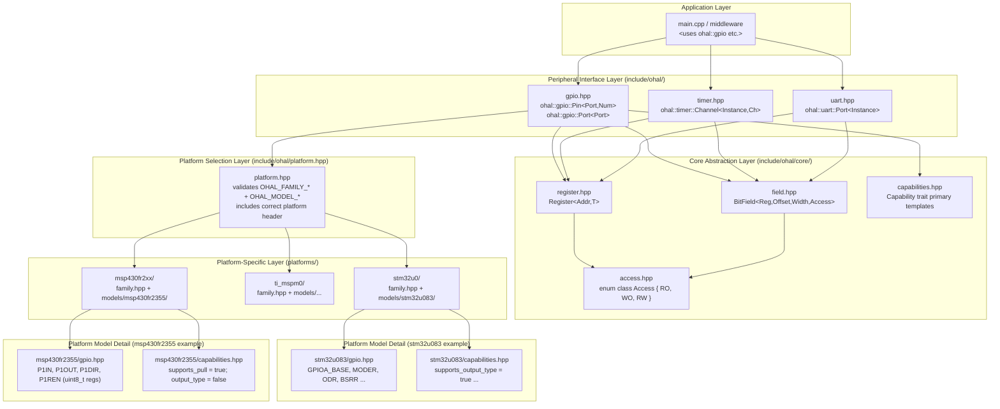

### 3.2 Class / Type Diagram

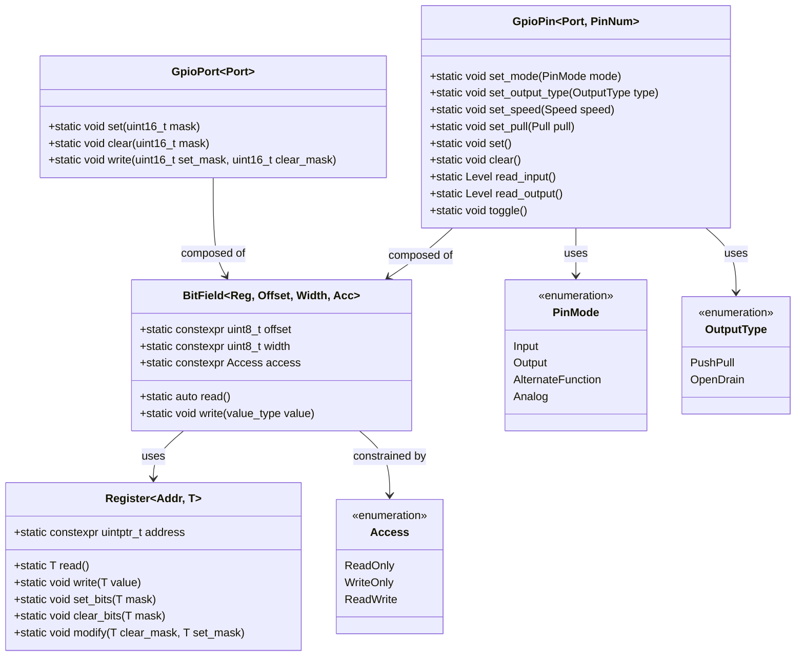

### 3.3 MCU Selection Flow


---

## 4. Repository Layout

```text
ohal/
├── .github/
│   └── workflows/
│       ├── ci.yml                       ← host build, cross-compile, static analysis (Step 12)
│       ├── conventional-commits.yml     ← PR title validation (Step 3)
│       ├── lint.yml                     ← single lint job that calls lint.sh (Step 2)
│       ├── zizmor.yml                   ← GitHub Actions security audit, pedantic mode (Step 2)
│       └── release-please.yml           ← automated versioning and changelog (Step 13)
├── cmake/
│   └── ohal-config.cmake.in             ← CMake package config template (Step 14)
├── docs/
│   ├── plan.md                          ← this index document
│   └── steps/
│       ├── step-01-build-infrastructure.md
│       ├── step-02-linting-formatting.md ← lint.sh, .clang-format, .clang-tidy, lint.yml, zizmor.yml
│       ├── step-03-conventional-commits-merge-queue.md ← conventional-commits.yml, merge queue
│       ├── step-04-register-abstraction.md
│       ├── step-05-bitfield-access-control.md
│       ├── step-06-mcu-selection.md
│       ├── step-07-gpio-interface.md
│       ├── step-08-stm32u0-gpio.md
│       ├── step-09-msp430fr2355-gpio.md  ← non-ARM concrete implementation (MSP430FR2355)
│       ├── step-10-timer-uart.md
│       ├── step-11-unit-testing.md
│       ├── step-12-ci.md
│       ├── step-13-release-automation.md ← release-please
│       ├── step-14-vcpkg-package.md
│       ├── step-15-additional-mcu-families.md
│       └── step-16-additional-peripherals.md
├── include/
│   └── ohal/
│       ├── ohal.hpp                     ← single top-level include for consumers
│       ├── platform.hpp                 ← MCU selection and validation
│       ├── core/
│       │   ├── register.hpp             ← Register<Addr, T> template
│       │   ├── field.hpp                ← BitField<Reg, Offset, Width, Access> template
│       │   ├── access.hpp               ← Access enum class
│       │   └── capabilities.hpp         ← Capability trait primary templates
│       ├── gpio.hpp                     ← ohal::gpio peripheral interface
│       ├── timer.hpp                    ← ohal::timer peripheral interface
│       ├── uart.hpp                     ← ohal::uart peripheral interface
│       ├── spi.hpp                      ← ohal::spi peripheral interface (Step 16)
│       ├── i2c.hpp                      ← ohal::i2c peripheral interface (Step 16)
│       ├── adc.hpp                      ← ohal::adc peripheral interface (Step 16)
│       ├── dac.hpp                      ← ohal::dac peripheral interface (Step 16)
│       ├── dma.hpp                      ← ohal::dma peripheral interface (Step 16)
│       ├── clock.hpp                    ← ohal::clock peripheral interface (Step 16)
│       ├── power.hpp                    ← ohal::power peripheral interface (Step 16)
│       └── mpu.hpp                      ← ohal::mpu peripheral interface (Step 16)
├── platforms/
│   ├── stm32u0/
│   │   ├── family.hpp                   ← STM32U0 family header (validates model)
│   │   └── models/
│   │       └── stm32u083/
│   │           ├── gpio.hpp             ← STM32U083 GPIO register map
│   │           ├── timer.hpp            ← STM32U083 Timer register map
│   │           ├── uart.hpp             ← STM32U083 UART/USART register map
│   │           ├── spi.hpp              ← STM32U083 SPI register map (Step 16)
│   │           ├── i2c.hpp              ← STM32U083 I2C register map (Step 16)
│   │           ├── adc.hpp              ← STM32U083 ADC register map (Step 16)
│   │           ├── dac.hpp              ← STM32U083 DAC register map (Step 16)
│   │           ├── dma.hpp              ← STM32U083 DMA register map (Step 16)
│   │           ├── clock.hpp            ← STM32U083 RCC register map (Step 16)
│   │           ├── power.hpp            ← STM32U083 PWR register map (Step 16)
│   │           └── capabilities.hpp     ← STM32U083 peripheral capability traits
│   ├── msp430fr2xx/                     ← added in Step 9
│   │   ├── family.hpp
│   │   └── models/
│   │       └── msp430fr2355/
│   │           ├── gpio.hpp
│   │           └── capabilities.hpp
│   └── ti_mspm0/                        ← added in Step 15
├── ports/
│   └── ohal/                            ← vcpkg overlay port (Step 14)
│       ├── portfile.cmake
│       └── vcpkg.json
├── tests/
│   ├── host/
│   │   ├── CMakeLists.txt
│   │   ├── test_register.cpp            ← tests for Register<> and BitField<>
│   │   ├── test_gpio_stm32u083.cpp      ← STM32U083 GPIO tests with mock registers
│   │   ├── test_gpio_msp430fr2355.cpp   ← MSP430FR2355 GPIO tests with 8-bit mock registers
│   │   └── mock/
│   │       └── mock_register.hpp        ← in-memory mock of volatile register access
│   ├── integration/                     ← vcpkg find_package integration test (Step 14)
│   │   ├── CMakeLists.txt
│   │   ├── vcpkg.json
│   │   ├── blink_stm32.cpp
│   │   └── blink_msp430.cpp
│   └── target/
│       ├── stm32u083/
│       │   └── test_gpio_stm32u083.cpp
│       └── msp430fr2355/
│           └── test_gpio_msp430fr2355.cpp
├── CMakeLists.txt
├── lint.sh                              ← single entry-point for all linting (Step 2)
├── .clang-format                        ← C++ formatting rules (Step 2)
├── .clang-tidy                          ← C++ static-analysis checks (Step 2)
├── .yamllint.yml                        ← YAML linting rules (Step 2)
├── .markdownlint.json                   ← Markdown linting rules (Step 2)
├── release-please-config.json           ← release-please configuration (Step 13)
├── .release-please-manifest.json        ← current version tracking (Step 13)
├── vcpkg.json                           ← vcpkg manifest for consumers (Step 14)
├── CHANGELOG.md                         ← generated by release-please (Step 13)
└── README.md
```

---

## 5. Stepwise Development Plan

Each step is documented in its own file. The sequence is designed so that each step's
prerequisites are completed before it begins.

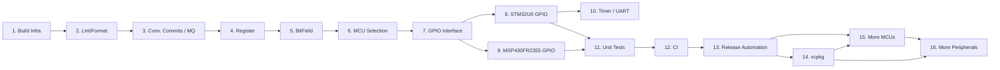

Step 2 (Linting and Formatting) is placed immediately after Build Infrastructure so that every
line of code written from Step 4 onward is lint-compliant on the first attempt. This eliminates
the need to retroactively reformat or fix static-analysis warnings across multiple
implementation steps.

Step 3 (Conventional Commits and Merge Queue) is placed before any implementation work so that
the git history is well-formed and machine-parseable from the very first implementation PR.
Every PR from Step 4 onward is squash-merged with a conventional commit title, ensuring that
`release-please` (Step 13) can accurately determine version bumps and generate `CHANGELOG.md`
entries without needing to re-examine or amend earlier history.

Steps 8 and 9 can be worked in parallel (both depend on Step 7, not on each other), but Step 8
is numbered first to reflect the principle of proving cross-platform portability at the GPIO
level _before_ expanding the peripheral count on a single platform. If MSP430FR2355 GPIO reveals
issues with the generic interface design, they can be corrected before Timer/UART is built,
avoiding rework.

Steps 13 and 14 (release automation and packaging) are deliberately placed _before_ the
expansion steps (15 and 16) so that:

- `release-please` is already configured to bump `vcpkg.json` versions before anyone starts
  consuming the package from new releases.
- Contributors adding new families (Step 15) or new peripherals (Step 16) can immediately open
  PRs that flow through the full release pipeline.

| Step | File                                                                                      | Phase            | Key Prerequisite |
| ---- | ----------------------------------------------------------------------------------------- | ---------------- | ---------------- |
| 1    | [Build Infrastructure](steps/step-01-build-infrastructure.md)                             | Core             | None             |
| 2    | [Linting and Formatting](steps/step-02-linting-formatting.md)                             | Core             | Step 1           |
| 3    | [Conventional Commits and Merge Queue](steps/step-03-conventional-commits-merge-queue.md) | Core             | Step 2           |
| 4    | [Core Register Abstraction](steps/step-04-register-abstraction.md)                        | Core             | Step 3           |
| 5    | [BitField and Access Control](steps/step-05-bitfield-access-control.md)                   | Core             | Step 4           |
| 6    | [MCU Family/Model Selection](steps/step-06-mcu-selection.md)                              | First platform   | Step 5           |
| 7    | [GPIO Peripheral Interface](steps/step-07-gpio-interface.md)                              | First platform   | Step 6           |
| 8    | [STM32U0 GPIO Implementation](steps/step-08-stm32u0-gpio.md)                              | First platform   | Step 7           |
| 9    | [MSP430FR2355 GPIO (non-ARM)](steps/step-09-msp430fr2355-gpio.md)                         | Second platform  | Step 7           |
| 10   | [Timer and UART Peripherals](steps/step-10-timer-uart.md)                                 | First platform   | Step 8           |
| 11   | [Host and Target Unit Testing](steps/step-11-unit-testing.md)                             | Validation       | Steps 8–10       |
| 12   | [CI / Continuous Integration](steps/step-12-ci.md)                                        | Validation       | Step 11          |
| 13   | [Release Automation](steps/step-13-release-automation.md)                                 | Release pipeline | Steps 3, 12      |
| 14   | [vcpkg Package](steps/step-14-vcpkg-package.md)                                           | Release pipeline | Step 13          |
| 15   | [Additional MCU Families and Models](steps/step-15-additional-mcu-families.md)            | Expansion        | Steps 13–14      |
| 16   | [Additional Peripherals](steps/step-16-additional-peripherals.md)                         | Expansion        | Steps 13–15      |

---

## 6. Detailed Design: Core Abstractions

### 6.1 Register Template

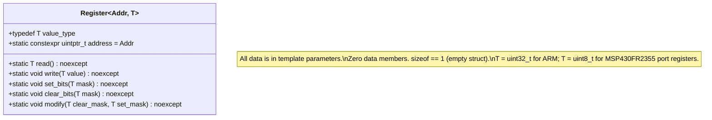

### 6.2 BitField Template

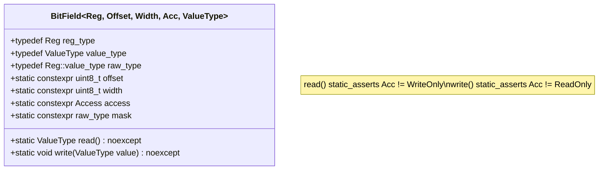

### 6.3 Type Relationships (STM32U083 example)

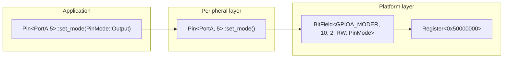

### 6.4 Type Relationships (MSP430FR2355 example)

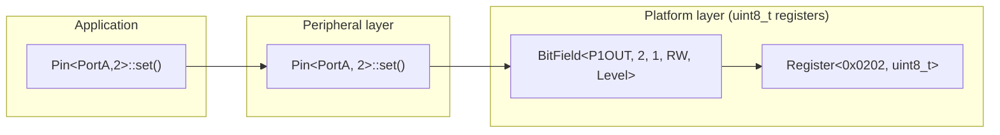

---

## 7. Detailed Design: MCU Selection

### 7.1 Define Combinations

| `OHAL_FAMILY_*` | `OHAL_MODEL_*` | Result                                                       |
| --------------- | -------------- | ------------------------------------------------------------ |
| (none)          | (any)          | Compile error: "No MCU family defined"                       |
| `STM32U0`       | (none)         | Compile error: "No STM32U0 model defined"                    |
| `STM32U0`       | `STM32U083`    | OK                                                           |
| `STM32U0`       | `MSP430FR2355` | Compile error: "Model MSP430FR2355 is not in family STM32U0" |
| `MSP430FR2XX`   | `MSP430FR2355` | OK                                                           |
| `MSP430FR2XX`   | (none)         | Compile error: "No MSP430FR2xx model defined"                |
| `TI_MSPM0`      | `MSPM0G3507`   | OK (once implemented)                                        |
| `TI_MSPM0`      | (none)         | Compile error: "No TI_MSPM0 model defined"                   |

### 7.2 How to Add a New MCU Family

1. Create `platforms/<new_family>/family.hpp` — list all supported models, include model headers.
2. Create `platforms/<new_family>/models/<model>/gpio.hpp` (and `timer.hpp`, `uart.hpp`).
3. Create `platforms/<new_family>/models/<model>/capabilities.hpp` — specialise capability traits.
4. Add the family to `platform.hpp`'s `#if … #elif` chain.
5. Add the model to `family.hpp`'s model validation.
6. Write host tests (mock register addresses, including 8-bit slots if needed).
7. Add cross-compile check to CI.

No changes to `include/ohal/gpio.hpp` (or any other peripheral interface header) are required.

---

## 8. Detailed Design: Peripheral Interface (GPIO)

### 8.1 GPIO Pin State Machine

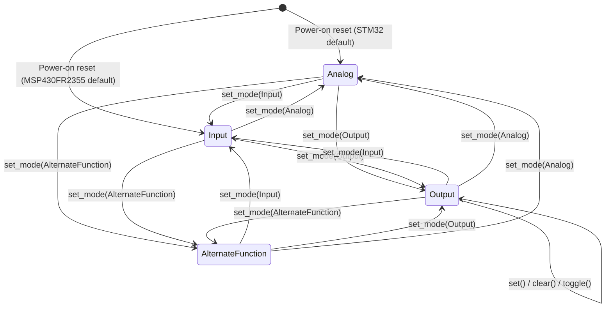

### 8.2 GPIO Configuration Sequence (STM32U083)

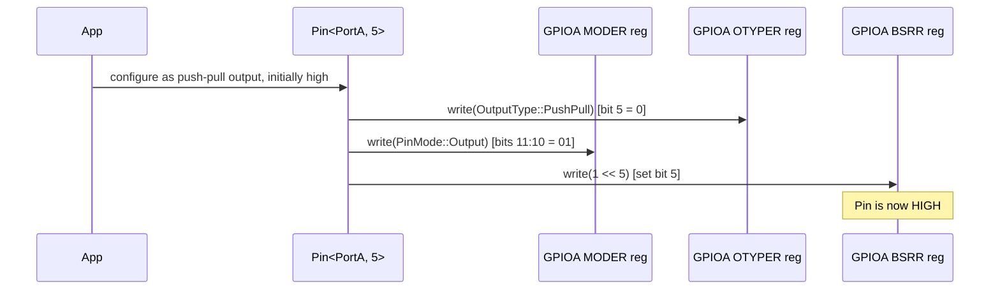

### 8.3 GPIO Configuration Sequence (MSP430FR2355)

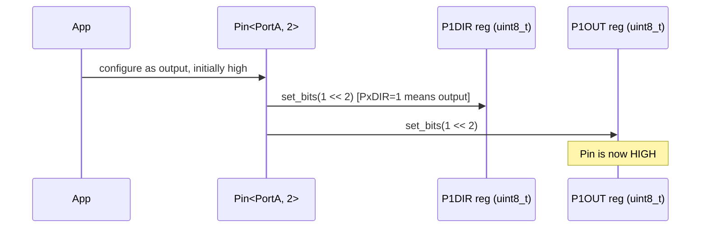

---

## 9. Detailed Design: Unit Testing Strategy

### 9.1 Host Test Architecture

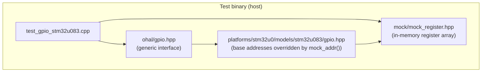

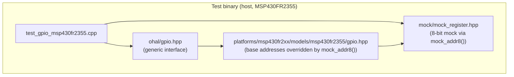

See [Step 11](steps/step-11-unit-testing.md) for the full mock infrastructure, target testing
approach, negative-compile test helper, and coverage targets.

---

## 10. Detailed Design: Error Strategy

### 10.1 Classes of Error

| Class                      | Mechanism                                  | Example message                                                                                                         |
| -------------------------- | ------------------------------------------ | ----------------------------------------------------------------------------------------------------------------------- |
| No MCU defined             | `#error` preprocessor directive            | `ohal: No MCU family defined. Pass -DOHAL_FAMILY_STM32U0 (or another family) to the compiler.`                          |
| Wrong model for family     | `#error` preprocessor directive            | `ohal: Model MSP430FR2355 is not part of family STM32U0. Check -DOHAL_MODEL_*.`                                         |
| Unimplemented peripheral   | `static_assert` in primary template        | `ohal: gpio::Pin is not implemented for the selected MCU. Ensure -DOHAL_FAMILY_* and -DOHAL_MODEL_* are set correctly.` |
| Write to read-only field   | `static_assert` in `BitField::write`       | `ohal: cannot write to a read-only field`                                                                               |
| Read from write-only field | `static_assert` in `BitField::read`        | `ohal: cannot read from a write-only field`                                                                             |
| BitField overflow          | `static_assert` in `BitField` body         | `ohal: BitField (Offset + Width) exceeds register width`                                                                |
| Out-of-range pin number    | `static_assert` in platform specialisation | `ohal: STM32U083 GPIOA has pins 0-15 only.`                                                                             |
| Unsupported feature        | `static_assert` in platform specialisation | `ohal: MSP430FR2355 GPIO does not support configurable output speed.`                                                   |

### 10.2 Error Design Principles

- All error messages are prefixed with `ohal:` for easy grep-ability.
- Messages are written in plain English and indicate both what went wrong and how to fix it.
- `static_assert` is preferred over `#error` wherever the check can be expressed as a constant
  expression (because `static_assert` provides more context in the compiler output).
- `#error` is used only in the platform selection headers where no types exist yet.

---

## 11. Namespace Convention

```text
ohal::               ← top-level namespace; platform selection lives here
ohal::core::         ← Register<>, BitField<>, Access enum — not for direct use by consumers
ohal::gpio::         ← GPIO peripheral types and enumerations
ohal::timer::        ← Timer peripheral types and enumerations
ohal::uart::         ← UART peripheral types and enumerations
ohal::spi::          ← SPI peripheral types and enumerations (Step 16)
ohal::i2c::          ← I2C peripheral types and enumerations (Step 16)
ohal::adc::          ← ADC peripheral types and enumerations (Step 16)
ohal::dac::          ← DAC peripheral types and enumerations (Step 16)
ohal::dma::          ← DMA stream types and enumerations (Step 16)
ohal::clock::        ← Clock enable/disable peripheral abstraction (Step 16)
ohal::power::        ← Power and sleep mode types (Step 16)
ohal::mpu::          ← MPU region types (Step 16, Cortex-M only)
ohal::test::         ← Mock infrastructure; only compiled in test builds
```

Consumers use:

```cpp
#include <ohal/ohal.hpp>    // single include
using namespace ohal::gpio;

using Led = Pin<PortA, 5>;
Led::set_mode(PinMode::Output);
Led::set();
```

---

## 12. Consumer Usage Examples

### 12.1 Blink an LED (STM32U083, PA5)

```cpp
// Compile with: -DOHAL_FAMILY_STM32U0 -DOHAL_MODEL_STM32U083 -std=c++17

#include <ohal/ohal.hpp>

using namespace ohal::gpio;

using Led = Pin<PortA, 5>;

int main() {
    Led::set_mode(PinMode::Output);
    Led::set_output_type(OutputType::PushPull);
    Led::set_speed(Speed::Low);
    Led::set_pull(Pull::None);
    Led::set();

    while (true) {
        Led::toggle();
        // some delay ...
    }
}
```

### 12.2 Blink an LED (MSP430FR2355, P1.2) — non-ARM

```cpp
// Compile with: -DOHAL_FAMILY_MSP430FR2XX -DOHAL_MODEL_MSP430FR2355 -std=c++17

#include <ohal/ohal.hpp>

using namespace ohal::gpio;

using Led = Pin<PortA, 2>;

int main() {
    Led::set_mode(PinMode::Output);
    Led::set();

    while (true) {
        Led::toggle();
        // some delay ...
    }
}
```

### 12.3 Unsupported Feature Compile Error (MSP430FR2355)

```cpp
// Compile with: -DOHAL_FAMILY_MSP430FR2XX -DOHAL_MODEL_MSP430FR2355
#include <ohal/ohal.hpp>

using namespace ohal::gpio;

int main() {
    Pin<PortA, 2>::set_speed(Speed::High);
    // → static_assert failure:
    //   "ohal: MSP430FR2355 GPIO does not support configurable output speed."
}
```

### 12.4 Read a Button (STM32U083, PC13)

```cpp
#include <ohal/ohal.hpp>

using namespace ohal::gpio;

using Button = Pin<PortC, 13>;

int main() {
    Button::set_mode(PinMode::Input);
    Button::set_pull(Pull::Up);

    if (Button::read_input() == Level::Low) {
        // button pressed (active low)
    }
}
```

### 12.5 Missing MCU Define

```cpp
// Compiled with no -DOHAL_FAMILY_* define:
#include <ohal/ohal.hpp>
// → #error: "ohal: No MCU family defined.
//            Pass -DOHAL_FAMILY_STM32U0 (or another family) to the compiler."
```

### 12.6 Atomic multi-pin write — H-bridge (STM32U083, Port A)

```cpp
// Compile with: -DOHAL_FAMILY_STM32U0 -DOHAL_MODEL_STM32U083 -std=c++17
#include <ohal/ohal.hpp>

using namespace ohal::gpio;

// H-bridge pins — all on Port A so a single Port<PortA>::write() covers all four.
using AHi = Pin<PortA, 4>;
using ALo = Pin<PortA, 5>;
using BHi = Pin<PortA, 6>;
using BLo = Pin<PortA, 7>;

// Encode each H-bridge state as a pair of (set_mask, clear_mask) computed at
// compile time.  Port<PortA>::write() translates to a single BSRR store on
// STM32 — no intermediate hardware state is ever visible.

static constexpr uint16_t kForwardSet   = (1U << 4) | (1U << 7); // AHi=1, BLo=1
static constexpr uint16_t kForwardClear = (1U << 5) | (1U << 6); // ALo=0, BHi=0

static constexpr uint16_t kReverseSet   = (1U << 5) | (1U << 6); // ALo=1, BHi=1
static constexpr uint16_t kReverseClear = (1U << 4) | (1U << 7); // AHi=0, BLo=0

static constexpr uint16_t kCoastClear   = (1U << 4) | (1U << 5) | (1U << 6) | (1U << 7);
static constexpr uint16_t kBrakeSet     = (1U << 5) | (1U << 7); // ALo=1, BLo=1
static constexpr uint16_t kBrakeClear   = (1U << 4) | (1U << 6); // AHi=0, BHi=0

void drive_forward() { Port<PortA>::write(kForwardSet,  kForwardClear); }
void drive_reverse() { Port<PortA>::write(kReverseSet,  kReverseClear); }
void coast()         { Port<PortA>::write(0,            kCoastClear);   }
void brake()         { Port<PortA>::write(kBrakeSet,    kBrakeClear);   }
```

No platform namespace is named in application code. The platform specialisation of
`Port<PortA>` (provided by the STM32U083 platform header, included automatically) implements
`write()` as a single BSRR store.

---

## 13. Open Questions and Future Work

| Topic                        | Question / Action                                                                                                                                                                                                                                                                                                                       |
| ---------------------------- | --------------------------------------------------------------------------------------------------------------------------------------------------------------------------------------------------------------------------------------------------------------------------------------------------------------------------------------- |
| Clock enabling enforcement   | `clock::Enable<>` is designed in [Step 16](steps/step-16-additional-peripherals.md) and enables peripheral bus clocks. The open question is whether OHAL should enforce at compile time that `clock::Enable<P>::enable()` has been called before any register in peripheral `P` is accessed — e.g. via a wrapper type or tag parameter. |
| Alternate Function mapping   | Setting AF mode requires knowing which AF number maps to which peripheral on each pin. Needs a per-model AF map table (constexpr array or template traits).                                                                                                                                                                             |
| Interrupt / EXTI             | GPIO interrupt configuration involves EXTI registers outside the GPIO block. Needs a separate `ohal::exti` abstraction.                                                                                                                                                                                                                 |
| Atomic register access       | On multi-core MCUs (e.g., STM32H7 dual-core) register access may need memory barriers or hardware semaphores. The `Register<>` template could be extended with an `Ordering` template parameter.                                                                                                                                        |
| C++20 concepts               | Once C++20 is permitted, `requires` clauses can replace `static_assert` chains for cleaner error messages.                                                                                                                                                                                                                              |
| PIC18 PORTB weak pull-ups    | PORTB has weak pull-up control via `RBPU` in `INTCON2`. This is not per-pin and lives outside the GPIO peripheral — consider a separate `ohal::pull` abstraction if PIC18 is added as an additional family in Step 15.                                                                                                                  |
| DMA runtime memory addresses | DMA is the one deliberate exception to the zero-runtime-data principle (see [Step 16](steps/step-16-additional-peripherals.md)). The design decision (NTTP peripheral address, runtime buffer pointer) should be reviewed once DMA is implemented.                                                                                      |
| TI MSPM0                     | MSPM0 GPIO uses 32-bit registers with a different layout from STM32. Register maps and capability traits must be gathered from the MSPM0G3507 Technical Reference Manual before implementation (see [Step 15](steps/step-15-additional-mcu-families.md)).                                                                               |
| Code size tracking           | A CI job should build a minimal blink example for each supported target and check that the resulting binary size does not regress. This guards the zero-overhead guarantee.                                                                                                                                                             |
