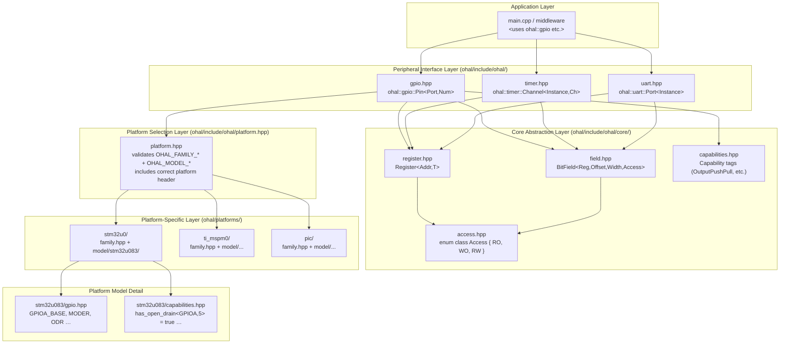
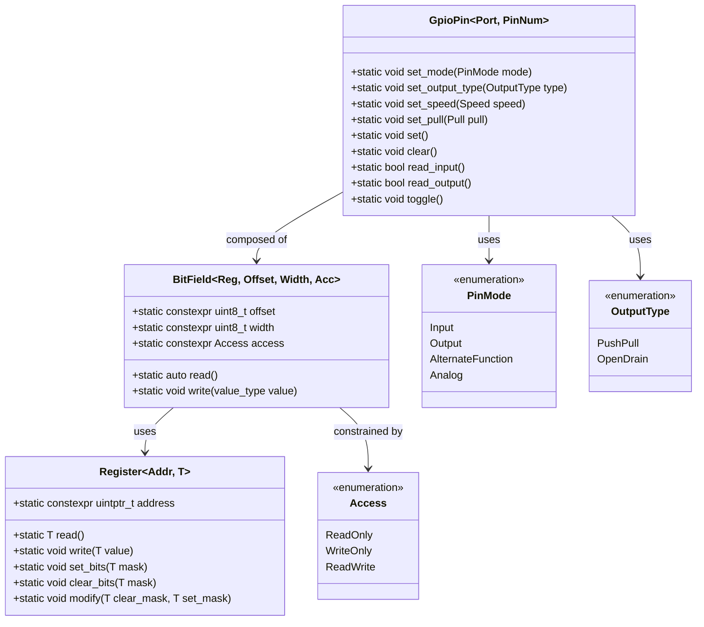
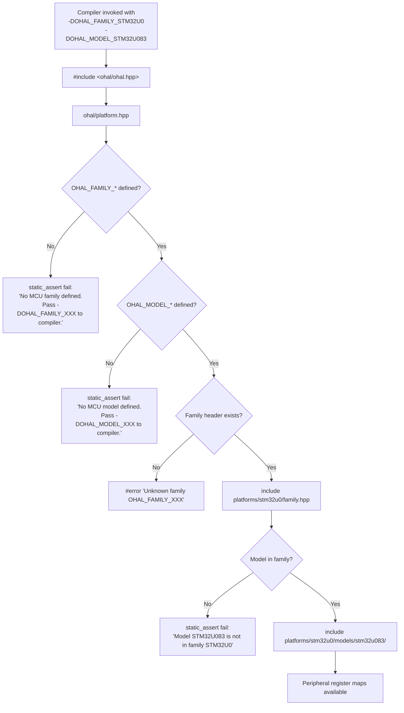
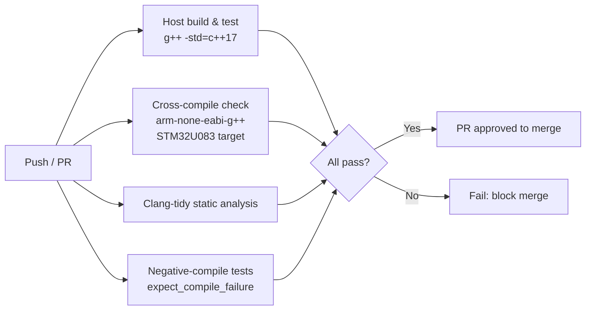
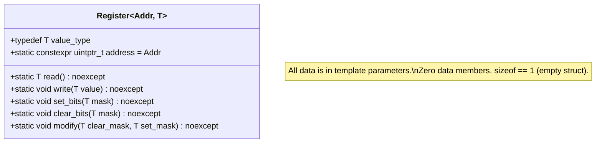
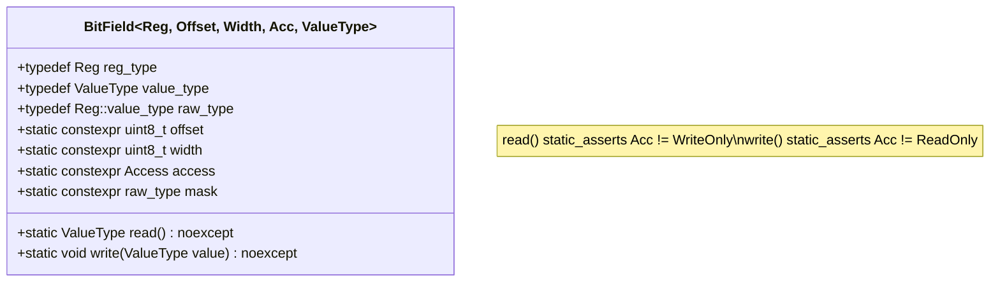
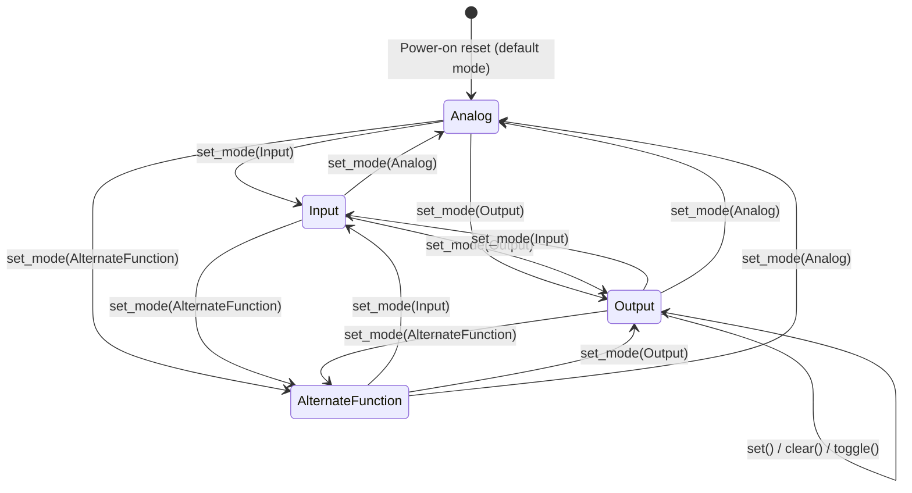
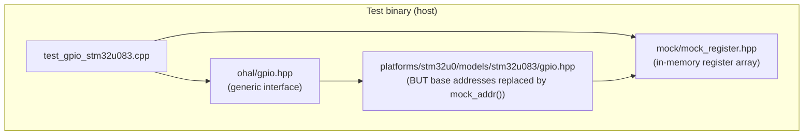

# OHAL – Zero Overhead Open HAL: Detailed Stepwise Development Plan

## Table of Contents

1. [Design Goals](#1-design-goals)
2. [Guiding Principles](#2-guiding-principles)
3. [Architecture Overview](#3-architecture-overview)
4. [Repository Layout](#4-repository-layout)
5. [Stepwise Development Plan](#5-stepwise-development-plan)
   - [Step 1 – Repository and Build Infrastructure](#step-1--repository-and-build-infrastructure)
   - [Step 2 – Core Register Abstraction Layer](#step-2--core-register-abstraction-layer)
   - [Step 3 – Bit Field and Access-Control Abstractions](#step-3--bit-field-and-access-control-abstractions)
   - [Step 4 – MCU Family and Model Selection Mechanism](#step-4--mcu-family-and-model-selection-mechanism)
   - [Step 5 – Peripheral Abstraction Interface (GPIO first)](#step-5--peripheral-abstraction-interface-gpio-first)
   - [Step 6 – First Concrete Platform: STM32U0 GPIO](#step-6--first-concrete-platform-stm32u0-gpio)
   - [Step 7 – Additional Peripherals (Timer, UART)](#step-7--additional-peripherals-timer-uart)
   - [Step 8 – Additional Platforms](#step-8--additional-platforms)
   - [Step 9 – Host and Target Unit Testing](#step-9--host-and-target-unit-testing)
   - [Step 10 – CI / Continuous Integration](#step-10--ci--continuous-integration)
6. [Detailed Design: Core Abstractions](#6-detailed-design-core-abstractions)
7. [Detailed Design: MCU Selection](#7-detailed-design-mcu-selection)
8. [Detailed Design: Peripheral Interface (GPIO)](#8-detailed-design-peripheral-interface-gpio)
9. [Detailed Design: Unit Testing Strategy](#9-detailed-design-unit-testing-strategy)
10. [Detailed Design: Error Strategy](#10-detailed-design-error-strategy)
11. [Namespace Convention](#11-namespace-convention)
12. [Consumer Usage Examples](#12-consumer-usage-examples)
13. [Open Questions and Future Work](#13-open-questions-and-future-work)

---

## 1. Design Goals

| # | Goal | Notes |
|---|------|-------|
| G1 | **Zero RAM at runtime** | All peripheral configuration is encoded in types and template parameters; no global or heap-allocated state is needed for the HAL itself. |
| G2 | **Register-write efficiency** | Every HAL operation must compile to the same instruction sequence as a hand-written `volatile` register access. Verified by inspecting generated assembly and zero-cost abstraction guarantees. |
| G3 | **Consistent API across MCU families** | The same `ohal::gpio` API works on STM32, TI MSP-M0, Microchip PIC, and any future platform with no changes to application code. |
| G4 | **Noisy compile-time failures** | If an application targets a peripheral feature that is not supported by the selected MCU, compilation fails with a human-readable `static_assert` message. |
| G5 | **Strongly typed** | Registers, bit fields, peripheral instances, pin modes, and all configuration values are distinct types — no `uint32_t` magic numbers in application code. |
| G6 | **Correct-by-construction** | Writing to a read-only register/field is a compile error. Reading from a write-only register/field is a compile error. |
| G7 | **No memory-map assumptions** | The HAL core layer makes no assumptions about register addresses. Every address is provided by the platform-specific layer. If a step requires register details, those details are listed explicitly (family, model, peripheral, register map). |
| G8 | **Unit testable on host and target** | The register abstraction layer is injectable; tests can run the same test cases on a development host (with simulated registers) and on the real target. |
| G9 | **C++17 strict** | No compiler extensions, no C++20 features. |
| G10 | **Consistent namespace** | All public symbols live inside `ohal::`. Peripheral types are in sub-namespaces: `ohal::gpio`, `ohal::timer`, `ohal::uart`. |
| G11 | **Minimal consumer imports** | Consumers write `using namespace ohal::gpio;` and nothing more (beyond including the single top-level header). |
| G12 | **MCU selection via compiler defines** | `-DOHAL_FAMILY_STM32U0` and `-DOHAL_MODEL_STM32U083`. Invalid or missing define combinations fail at compile time. |

---

## 2. Guiding Principles

### 2.1 Everything at Compile Time

The HAL is a collection of **type-level** descriptions of hardware. A "GPIO port A, pin 5" is a type, not a runtime variable. Calling `set()` on that type emits a single `STR` instruction (or equivalent) and nothing else. No vtables, no virtual dispatch, no heap allocation, no dynamic branching.

### 2.2 Platform-Specific Code is Isolated

Application code (`main.cpp`, middleware) only ever sees the generic `ohal` interface headers. Platform-specific register maps and capability tables live entirely inside `ohal/platforms/`. The build system injects the correct platform directory into the include path via the MCU defines.

### 2.3 Capabilities are Modelled, Not Guarded at Runtime

If a GPIO pin does not support open-drain output on the chosen MCU, there is no runtime branch that returns an error code. Instead, instantiating the open-drain configuration for that pin does not compile. The capability model is expressed as template specialisation: if no specialisation exists for a given (peripheral, feature) pair, the primary template raises a `static_assert`.

### 2.4 Tests Drive Design

Every abstraction layer in Steps 2–5 has a corresponding host-side test written using only C++ standard library facilities (no OS, no hardware). This ensures the abstraction is testable in isolation, confirms the zero-overhead goal by inspecting compiler output, and catches regressions early.

---

## 3. Architecture Overview

### 3.1 Layer Diagram



### 3.2 Class / Type Diagram



### 3.3 MCU Selection Flow



---

## 4. Repository Layout

```
ohal/
├── docs/
│   └── plan.md                     ← this document
├── include/
│   └── ohal/
│       ├── ohal.hpp                ← single top-level include for consumers
│       ├── platform.hpp            ← MCU selection and validation
│       ├── core/
│       │   ├── register.hpp        ← Register<Addr, T> template
│       │   ├── field.hpp           ← BitField<Reg, Offset, Width, Access> template
│       │   ├── access.hpp          ← Access enum class
│       │   └── capabilities.hpp    ← Capability tag types and primary templates
│       ├── gpio.hpp                ← ohal::gpio peripheral interface
│       ├── timer.hpp               ← ohal::timer peripheral interface
│       └── uart.hpp                ← ohal::uart peripheral interface
├── platforms/
│   ├── stm32u0/
│   │   ├── family.hpp              ← STM32U0 family header (validates model)
│   │   └── models/
│   │       └── stm32u083/
│   │           ├── gpio.hpp        ← STM32U083 GPIO register map
│   │           ├── timer.hpp       ← STM32U083 Timer register map
│   │           ├── uart.hpp        ← STM32U083 UART/USART register map
│   │           └── capabilities.hpp ← STM32U083 peripheral capability traits
│   ├── ti_mspm0/
│   │   ├── family.hpp
│   │   └── models/
│   │       └── mspm0g3507/
│   │           ├── gpio.hpp
│   │           └── capabilities.hpp
│   └── pic/
│       ├── family.hpp
│       └── models/
│           └── pic18f4550/
│               ├── gpio.hpp
│               └── capabilities.hpp
├── tests/
│   ├── host/
│   │   ├── CMakeLists.txt
│   │   ├── test_register.cpp       ← tests for Register<> and BitField<>
│   │   ├── test_gpio_interface.cpp ← tests for GPIO interface with mock registers
│   │   └── mock/
│   │       └── mock_register.hpp   ← in-memory mock of volatile register access
│   └── target/
│       └── stm32u083/
│           └── test_gpio_stm32u083.cpp
├── CMakeLists.txt
└── README.md
```

---

## 5. Stepwise Development Plan

### Step 1 – Repository and Build Infrastructure

**Goal:** A working CMake project that can build and run host-side tests.

**Inputs required:** None — no hardware knowledge needed at this step.

**Tasks:**

1. Create root `CMakeLists.txt` requiring CMake ≥ 3.21 and C++17.
2. Add a `tests/host/CMakeLists.txt` using CMake's built-in `FetchContent` to pull a testing framework (e.g., [Catch2](https://github.com/catchorg/Catch2) or [doctest](https://github.com/doctest/doctest)) at configure time.
3. Add a CMake option `OHAL_BUILD_TESTS` (default `ON`) to enable/disable tests.
4. Add a CMake option `OHAL_MCU_FAMILY` and `OHAL_MCU_MODEL` so the family/model can also be passed through CMake (these become compile definitions).
5. Configure compiler flags: `-Wall -Wextra -Wpedantic -Werror -std=c++17`.
6. Verify the build succeeds with an empty `main.cpp`.

**Acceptance criteria:**
- `cmake -B build && cmake --build build` succeeds.
- `ctest --test-dir build` runs (even with no tests yet).

---

### Step 2 – Core Register Abstraction Layer

**Goal:** A header-only `Register<Addr, T>` type that models a single hardware register.

**Inputs required:** None — addresses are supplied by the platform layer (Step 4 onward).

**Key design decisions:**

- The type is a struct template with **no data members**. All methods are `static`.
- The volatile pointer cast is the only place in the codebase that touches `reinterpret_cast`; it is wrapped in this single header.
- `T` defaults to `uint32_t`; 8-bit and 16-bit MCUs can use `uint8_t` or `uint16_t`.

**Interface:**

```cpp
namespace ohal::core {

template <uintptr_t Address, typename T = uint32_t>
struct Register {
    using value_type = T;
    static constexpr uintptr_t address = Address;

    static T read() noexcept {
        return *reinterpret_cast<volatile T const*>(address);
    }

    static void write(T value) noexcept {
        *reinterpret_cast<volatile T*>(address) = value;
    }

    static void set_bits(T mask) noexcept {
        write(read() | mask);
    }

    static void clear_bits(T mask) noexcept {
        write(read() & static_cast<T>(~mask));
    }

    static void modify(T clear_mask, T set_mask) noexcept {
        write((read() & static_cast<T>(~clear_mask)) | set_mask);
    }
};

} // namespace ohal::core
```

**Tests to write (host, Step 9):**

- `Register::write` stores the value at the correct address (use mock memory array as the "register").
- `Register::read` returns the stored value.
- `Register::set_bits` ORs correctly without disturbing other bits.
- `Register::clear_bits` ANDs correctly.
- `Register::modify` applies clear then set in a single logical step.

---

### Step 3 – Bit Field and Access-Control Abstractions

**Goal:** `BitField<Reg, Offset, Width, Access>` — a compile-time descriptor for a field within a register, with enforced read/write access control.

**Inputs required:** None.

**Key design decisions:**

- Access control is checked by `static_assert` at call site — attempting to `read()` a write-only field or `write()` a read-only field causes a compile error with a descriptive message.
- `Offset + Width` is bounds-checked against `sizeof(T) * 8` at instantiation time.
- Fields returning enum values use a second template parameter `ValueType` so that callers get back the enum type, not a raw integer.

**Interface:**

```cpp
namespace ohal::core {

enum class Access : uint8_t {
    ReadOnly  = 0,
    WriteOnly = 1,
    ReadWrite = 2,
};

template <
    typename Reg,
    uint8_t  Offset,
    uint8_t  Width,
    Access   Acc,
    typename ValueType = typename Reg::value_type
>
struct BitField {
    using reg_type   = Reg;
    using value_type = ValueType;
    using raw_type   = typename Reg::value_type;

    static constexpr uint8_t  offset = Offset;
    static constexpr uint8_t  width  = Width;
    static constexpr Access   access = Acc;
    static constexpr raw_type mask   =
        static_cast<raw_type>(((raw_type{1} << Width) - raw_type{1}) << Offset);

    static_assert(Width > 0,
        "ohal: BitField width must be at least 1");
    static_assert(static_cast<unsigned>(Offset) + static_cast<unsigned>(Width)
                      <= sizeof(raw_type) * 8u,
        "ohal: BitField (Offset + Width) exceeds register width");

    static ValueType read() noexcept {
        static_assert(Acc != Access::WriteOnly,
            "ohal: cannot read from a write-only field");
        return static_cast<ValueType>((Reg::read() & mask) >> Offset);
    }

    static void write(ValueType value) noexcept {
        static_assert(Acc != Access::ReadOnly,
            "ohal: cannot write to a read-only field");
        Reg::modify(mask, (static_cast<raw_type>(value) << Offset) & mask);
    }
};

} // namespace ohal::core
```

**Tests to write (host, Step 9):**

- Writing to a `ReadWrite` field updates only the correct bits.
- Reading from a `ReadWrite` field returns the correct extracted value.
- Static assertion fires when `Offset + Width` overflows (verified by compile-error test or `static_assert` inspection).
- `WriteOnly` field's `read()` and `ReadOnly` field's `write()` produce the correct compiler error string (verified in negative-compile tests).

---

### Step 4 – MCU Family and Model Selection Mechanism

**Goal:** A `platform.hpp` that validates the MCU defines and includes the correct platform header, and a skeleton for the first platform (STM32U0 / STM32U083).

**Inputs required for STM32U083:**
- MCU family: STM32U0
- MCU model: STM32U083
- Peripheral: GPIO
- Register base addresses: See the STM32U083 Reference Manual (RM0503)
  - GPIOA base: `0x42020000`
  - GPIOB base: `0x42020400`
  - GPIOC base: `0x42020800`
  - GPIOD base: `0x42020C00`
  - GPIOE base: `0x42021000`
  - GPIOF base: `0x42021400`
- Register offsets within each GPIO block (identical across all STM32U0 GPIO ports):
  - `MODER`   offset `0x00` — pin mode (Input / Output / AF / Analog)
  - `OTYPER`  offset `0x04` — output type (Push-Pull / Open-Drain)
  - `OSPEEDR` offset `0x08` — output speed
  - `PUPDR`   offset `0x0C` — pull-up / pull-down
  - `IDR`     offset `0x10` — input data register (RO)
  - `ODR`     offset `0x14` — output data register
  - `BSRR`    offset `0x18` — bit set/reset register (WO)
  - `LCKR`    offset `0x1C` — configuration lock register
  - `AFRL`    offset `0x20` — alternate function low (pins 0–7)
  - `AFRH`    offset `0x24` — alternate function high (pins 8–15)

**`platform.hpp` logic:**

```cpp
// ohal/include/ohal/platform.hpp

#if !defined(OHAL_FAMILY_STM32U0) && \
    !defined(OHAL_FAMILY_TI_MSPM0) && \
    !defined(OHAL_FAMILY_PIC)
  #error "ohal: No MCU family defined. " \
         "Pass one of -DOHAL_FAMILY_STM32U0, -DOHAL_FAMILY_TI_MSPM0, " \
         "-DOHAL_FAMILY_PIC to the compiler."
#endif

#if defined(OHAL_FAMILY_STM32U0)
  #include "ohal/platforms/stm32u0/family.hpp"
#elif defined(OHAL_FAMILY_TI_MSPM0)
  #include "ohal/platforms/ti_mspm0/family.hpp"
#elif defined(OHAL_FAMILY_PIC)
  #include "ohal/platforms/pic/family.hpp"
#endif
```

**`stm32u0/family.hpp` logic:**

```cpp
// ohal/platforms/stm32u0/family.hpp

#if !defined(OHAL_MODEL_STM32U083) && \
    !defined(OHAL_MODEL_STM32U073) /* … list all U0 models … */
  #error "ohal: No STM32U0 model defined. " \
         "Pass -DOHAL_MODEL_STM32U083 (or another U0 model) to the compiler."
#endif

#if defined(OHAL_MODEL_STM32U083)
  #include "ohal/platforms/stm32u0/models/stm32u083/gpio.hpp"
  #include "ohal/platforms/stm32u0/models/stm32u083/timer.hpp"
  #include "ohal/platforms/stm32u0/models/stm32u083/uart.hpp"
  #include "ohal/platforms/stm32u0/models/stm32u083/capabilities.hpp"
// … other models …
#endif
```

**Tests to write (Step 9):**

- Compiling with no defines produces the "No MCU family defined" error.
- Compiling with `OHAL_FAMILY_STM32U0` but no model produces the "No STM32U0 model defined" error.
- Compiling with `OHAL_FAMILY_STM32U0` + `OHAL_MODEL_STM32U083` succeeds.
- Compiling with an invalid family produces the unknown-family error.

---

### Step 5 – Peripheral Abstraction Interface (GPIO first)

**Goal:** A generic `ohal::gpio::Pin<Port, PinNum>` that provides the full GPIO API without any reference to register addresses.

**Inputs required:** None — the register addresses come from the platform layer, which is already included via `platform.hpp`.

**Key design decisions:**

- `Port` is a tag type (e.g., `ohal::gpio::PortA`), not an integer. This prevents silent errors from swapping port and pin number.
- `PinNum` is a `uint8_t` NTTP (non-type template parameter). Out-of-range values (e.g., pin 16 on a 16-bit port) are caught by `static_assert`.
- The implementation body of each method is provided by **partial specialisation** in the platform-specific header (e.g., `stm32u083/gpio.hpp`). If the platform header has not defined the specialisation, the primary template fires a `static_assert`:

  ```
  ohal: gpio::Pin is not implemented for the selected MCU model.
  ```

**Port tag types (generic):**

```cpp
namespace ohal::gpio {
    struct PortA {};
    struct PortB {};
    struct PortC {};
    struct PortD {};
    struct PortE {};
    struct PortF {};
} // namespace ohal::gpio
```

**Enumerations (generic):**

```cpp
namespace ohal::gpio {

enum class PinMode   : uint8_t { Input = 0, Output = 1, AlternateFunction = 2, Analog = 3 };
enum class OutputType: uint8_t { PushPull = 0, OpenDrain = 1 };
enum class Speed     : uint8_t { Low = 0, Medium = 1, High = 2, VeryHigh = 3 };
enum class Pull      : uint8_t { None = 0, Up = 1, Down = 2 };
enum class Level     : uint8_t { Low = 0, High = 1 };

} // namespace ohal::gpio
```

**Primary (unimplemented) template:**

```cpp
namespace ohal::gpio {

template <typename Port, uint8_t PinNum>
struct Pin {
    static_assert(sizeof(Port) == 0,
        "ohal: gpio::Pin is not implemented for the selected MCU. "
        "Ensure -DOHAL_FAMILY_* and -DOHAL_MODEL_* are set correctly.");
};

} // namespace ohal::gpio
```

---

### Step 6 – First Concrete Platform: STM32U0 GPIO

**Goal:** A full STM32U083 partial specialisation of `ohal::gpio::Pin<Port, PinNum>`.

**Inputs required:**
- MCU family: STM32U0
- MCU model: STM32U083
- GPIO register base addresses and offsets: listed in Step 4
- Peripheral capability facts:
  - All STM32U083 GPIO pins support: Input, Output Push-Pull, Output Open-Drain, Alternate Function, Analog
  - BSRR is write-only (bits 0–15 set, bits 16–31 reset)
  - IDR is read-only
  - MODER, OTYPER, OSPEEDR, PUPDR, ODR, AFRL, AFRH are read-write

**Mermaid sequence — "set GPIO pin high" on STM32U083:**

```mermaid
sequenceDiagram
    participant App as Application
    participant Pin as gpio::Pin&lt;PortA,5&gt;
    participant BSRR as GPIOA_BSRR (WO register)

    App->>Pin: Pin::set()
    Pin->>BSRR: write(1u << 5)
    Note over BSRR: Single 32-bit store instruction.<br/>Zero overhead vs. direct register write.
```

**Implementation skeleton (`stm32u083/gpio.hpp`):**

```cpp
// ohal/platforms/stm32u0/models/stm32u083/gpio.hpp

#pragma once
#include "ohal/core/register.hpp"
#include "ohal/core/field.hpp"
#include "ohal/gpio.hpp"

namespace ohal::gpio {

namespace detail::stm32u083 {

    // Helper: compute MODER field offset for pin N (2 bits per pin)
    template <uint8_t Pin>
    using ModerField = core::BitField<
        core::Register</*GPIOA_BASE*/ 0x42020000u + /*MODER offset*/ 0x00u>,
        Pin * 2u, 2u, core::Access::ReadWrite, PinMode
    >;

    // … similar for OTYPER, OSPEEDR, PUPDR, ODR, IDR, BSRR …

} // namespace detail::stm32u083

// Partial specialisation for PortA
template <uint8_t PinNum>
struct Pin<PortA, PinNum> {
    static_assert(PinNum < 16u, "ohal: STM32U083 GPIOA has pins 0–15 only.");

    using MODER  = core::BitField<
        core::Register<0x42020000u>, PinNum * 2u, 2u,
        core::Access::ReadWrite, PinMode>;
    using OTYPER = core::BitField<
        core::Register<0x42020004u>, PinNum, 1u,
        core::Access::ReadWrite, OutputType>;
    using OSPEEDR = core::BitField<
        core::Register<0x42020008u>, PinNum * 2u, 2u,
        core::Access::ReadWrite, Speed>;
    using PUPDR  = core::BitField<
        core::Register<0x4202000Cu>, PinNum * 2u, 2u,
        core::Access::ReadWrite, Pull>;
    using IDR    = core::BitField<
        core::Register<0x42020010u>, PinNum, 1u,
        core::Access::ReadOnly, Level>;
    using ODR    = core::BitField<
        core::Register<0x42020014u>, PinNum, 1u,
        core::Access::ReadWrite, Level>;
    // BSRR: bits 0-15 = set, bits 16-31 = reset; modelled as two write-only fields
    using BSRR_SET   = core::BitField<
        core::Register<0x42020018u>, PinNum,        1u, core::Access::WriteOnly>;
    using BSRR_RESET = core::BitField<
        core::Register<0x42020018u>, PinNum + 16u,  1u, core::Access::WriteOnly>;

    static void set_mode(PinMode mode) noexcept       { MODER::write(mode); }
    static void set_output_type(OutputType t) noexcept{ OTYPER::write(t); }
    static void set_speed(Speed s) noexcept           { OSPEEDR::write(s); }
    static void set_pull(Pull p) noexcept             { PUPDR::write(p); }
    static void set()   noexcept { BSRR_SET::write(1u); }
    static void clear() noexcept { BSRR_RESET::write(1u); }
    static Level read_input()  noexcept { return IDR::read(); }
    static Level read_output() noexcept { return ODR::read(); }
    static void toggle() noexcept {
        if (read_output() == Level::Low) set();
        else clear();
    }
};

// Repeat for PortB … PortF (identical structure, different base address)

} // namespace ohal::gpio
```

**Capability check example:**

```cpp
// stm32u083/capabilities.hpp
namespace ohal::gpio::capabilities {

// All STM32U083 pins support open drain
template <typename Port, uint8_t Pin>
struct supports_open_drain : std::true_type {};

} // namespace ohal::gpio::capabilities
```

**Tests to write (host):**

- `Pin<PortA, 5>::set()` writes `(1u << 5)` to the BSRR address (verified using mock register memory).
- `Pin<PortA, 5>::clear()` writes `(1u << 21)` to BSRR.
- `Pin<PortA, 5>::set_mode(PinMode::Output)` writes `0b01` to MODER bits 11:10.
- `Pin<PortA, 5>::read_input()` reads bit 5 of IDR.
- Writing to `IDR` (a read-only field) fails to compile.

---

### Step 7 – Additional Peripherals (Timer, UART)

**Goal:** Replicate the pattern from Steps 5–6 for Timer and UART peripherals.

**Inputs required for STM32U083 Timer (TIM2):**
- TIM2 base address: `0x40000000`
- Relevant registers and offsets (from RM0503):
  - `CR1`  `0x00` — control register 1
  - `CR2`  `0x04` — control register 2
  - `DIER` `0x0C` — DMA/interrupt enable register
  - `SR`   `0x10` — status register
  - `EGR`  `0x14` — event generation register (WO)
  - `CCMR1` `0x18` — capture/compare mode register 1
  - `CCMR2` `0x1C` — capture/compare mode register 2
  - `CCER` `0x20` — capture/compare enable register
  - `CNT`  `0x24` — counter register
  - `PSC`  `0x28` — prescaler register
  - `ARR`  `0x2C` — auto-reload register
  - `CCR1`–`CCR4` `0x34`–`0x40` — capture/compare registers

**Inputs required for STM32U083 UART (USART2):**
- USART2 base address: `0x40004400`
- Relevant registers:
  - `CR1`  `0x00`
  - `CR2`  `0x04`
  - `CR3`  `0x08`
  - `BRR`  `0x0C` — baud rate register
  - `ISR`  `0x1C` — interrupt and status register (RO)
  - `ICR`  `0x20` — interrupt flag clear register (WO)
  - `RDR`  `0x24` — receive data register (RO)
  - `TDR`  `0x28` — transmit data register (WO)

**Approach:** Follow the identical pattern as GPIO (Steps 5–6):

1. Define generic enumerations and primary (unimplemented) template in `include/ohal/timer.hpp` and `include/ohal/uart.hpp`.
2. Implement partial specialisations in the STM32U083 platform headers.

---

### Step 8 – Additional Platforms

**Goal:** Implement the same peripheral abstractions for a second MCU family to validate that the architecture truly delivers cross-platform consistency.

**Suggested second platform: TI MSPM0G3507**

**Inputs required:**
- MCU family: TI_MSPM0
- MCU model: MSPM0G3507
- MCU peripheral features: GPIO with 4-wire configuration (direction, data, interrupt, alternate function), 32-bit registers
- MCU peripheral register memory map (from MSPM0G3507 Technical Reference Manual SLAU846):
  - GPIOA base: `0x400A0000`
  - GPIOB base: `0x400A2000`
  - `DOUT31_0`  offset `0x1280` — data output register
  - `DOUTSET31_0` offset `0x1290` — set output bits (WO)
  - `DOUTCLR31_0` offset `0x1294` — clear output bits (WO)
  - `DOUTTGL31_0` offset `0x1298` — toggle output bits (WO)
  - `DIN31_0`   offset `0x1380` — data input register (RO)
  - `DOE31_0`   offset `0x1200` — output enable register

**Approach:**

1. Add `platforms/ti_mspm0/family.hpp` — validates model.
2. Add `platforms/ti_mspm0/models/mspm0g3507/gpio.hpp` — partial specialisations.
3. Application code using `ohal::gpio::Pin<PortA, 5>` compiles unchanged.
4. Run the same GPIO host tests against the TI mock registers.

---

### Step 9 – Host and Target Unit Testing

**Goal:** A complete, runnable test suite on the development host, and a framework for on-target testing.

#### 9.1 Host Testing with Mock Registers

The mock infrastructure replaces the `volatile` memory-mapped I/O with plain in-memory arrays. This is achieved by **not** using the real platform headers during host tests. Instead, the test provides its own register addresses pointing into a local array:

```cpp
// tests/host/mock/mock_register.hpp
#pragma once
#include <array>
#include <cstdint>

namespace ohal::test {

// 256 bytes of simulated register space
inline std::array<uint32_t, 64> mock_memory{};

// Helper: reset mock memory between tests
inline void reset_mock() { mock_memory.fill(0); }

// Returns the uintptr_t address of slot N in mock_memory
constexpr uintptr_t mock_addr(std::size_t slot) {
    return reinterpret_cast<uintptr_t>(mock_memory.data()) + slot * sizeof(uint32_t);
}

} // namespace ohal::test
```

Host tests then instantiate `Register<mock_addr(0)>` and `BitField<Register<mock_addr(0)>, ...>` and verify that the correct memory locations are modified:

```cpp
// tests/host/test_register.cpp  (example using Catch2)
#include <catch2/catch_test_macros.hpp>
#include "mock/mock_register.hpp"
#include "ohal/core/register.hpp"

TEST_CASE("Register::write stores value at correct address") {
    ohal::test::reset_mock();
    using Reg = ohal::core::Register<ohal::test::mock_addr(0)>;
    Reg::write(0xDEADBEEFu);
    REQUIRE(ohal::test::mock_memory[0] == 0xDEADBEEFu);
}

TEST_CASE("Register::set_bits ORs without disturbing other bits") {
    ohal::test::reset_mock();
    ohal::test::mock_memory[0] = 0xF0F0F0F0u;
    using Reg = ohal::core::Register<ohal::test::mock_addr(0)>;
    Reg::set_bits(0x0F0F0F0Fu);
    REQUIRE(ohal::test::mock_memory[0] == 0xFFFFFFFFu);
}
```

#### 9.2 Target Testing

On-target tests use the same test source files but are compiled for the real MCU. A minimal on-target test runner:

1. Resets all GPIOs to a known state.
2. Calls each test function.
3. Reports pass/fail over UART or an LED toggle pattern.

The test CMake target `ohal_target_tests` links the test sources plus the real platform headers and the BSP startup files. It is built only when `CMAKE_SYSTEM_PROCESSOR` is a cross-compile target (e.g., `arm-none-eabi`).

#### 9.3 Negative-Compile Tests

For tests that must confirm a compile error occurs, add a CMake helper `ohal_expect_compile_failure`:

```cmake
# Compiles the source with expected_error string in compiler stderr.
# Fails the CMake test if the compilation succeeds or if the error string is absent.
function(ohal_expect_compile_failure test_name source_file expected_error)
    add_test(NAME ${test_name}
        COMMAND ${CMAKE_COMMAND}
            -DSOURCE=${source_file}
            -DEXPECTED_ERROR=${expected_error}
            -P ${CMAKE_CURRENT_SOURCE_DIR}/cmake/expect_compile_failure.cmake
    )
endfunction()
```

Example negative-compile tests:

| Test name | Source fragment | Expected error string |
|---|---|---|
| `write_to_readonly_field` | `IDR_field::write(Level::High)` | `cannot write to a read-only field` |
| `read_from_writeonly_field` | `BSRR_SET_field::read()` | `cannot read from a write-only field` |
| `overflow_bitfield` | `BitField<Reg, 30, 4, RW>` | `BitField (Offset + Width) exceeds register width` |
| `no_family_defined` | Compile with no defines | `No MCU family defined` |
| `wrong_model_for_family` | `OHAL_FAMILY_STM32U0` + `OHAL_MODEL_MSPM0G3507` | `not in family STM32U0` |

---

### Step 10 – CI / Continuous Integration

**Goal:** Automated build and test on every pull request.

**GitHub Actions workflow jobs:**



**Required inputs for cross-compile check:**
- `arm-none-eabi-gcc` toolchain installed in the runner image.
- STM32U083 linker script (`.ld`) and CMSIS startup file (outside the scope of OHAL; OHAL itself is header-only).

---

## 6. Detailed Design: Core Abstractions

### 6.1 Register Template



### 6.2 BitField Template



### 6.3 Type Relationships


---

## 7. Detailed Design: MCU Selection

### 7.1 Define Combinations

| `OHAL_FAMILY_*` | `OHAL_MODEL_*` | Result |
|---|---|---|
| (none) | (any) | Compile error: "No MCU family defined" |
| `STM32U0` | (none) | Compile error: "No STM32U0 model defined" |
| `STM32U0` | `STM32U083` | OK |
| `STM32U0` | `MSPM0G3507` | Compile error: "Model MSPM0G3507 is not in family STM32U0" |
| `TI_MSPM0` | `MSPM0G3507` | OK (once implemented) |
| `TI_MSPM0` | (none) | Compile error: "No TI_MSPM0 model defined" |

### 7.2 How to Add a New MCU Family

1. Create `platforms/<new_family>/family.hpp` — list all supported models, include model headers.
2. Create `platforms/<new_family>/models/<model>/gpio.hpp` (and `timer.hpp`, `uart.hpp`).
3. Add the family to `platform.hpp`'s `#if … #elif` chain.
4. Add the model to `family.hpp`'s model validation.
5. Write host tests (mock register addresses).
6. Add cross-compile check to CI.

No changes to `include/ohal/gpio.hpp` (or any other peripheral interface header) are required.

---

## 8. Detailed Design: Peripheral Interface (GPIO)

### 8.1 GPIO Pin State Machine



### 8.2 GPIO Configuration Sequence

```mermaid
sequenceDiagram
    participant App
    participant Pin as Pin&lt;PortA, 5&gt;
    participant MODER as GPIOA MODER reg
    participant OTYPER as GPIOA OTYPER reg
    participant BSRR as GPIOA BSRR reg

    App->>Pin: configure as push-pull output, initially high
    Pin->>OTYPER: write(OutputType::PushPull) [bit 5 = 0]
    Pin->>MODER: write(PinMode::Output) [bits 11:10 = 01]
    Pin->>BSRR: write(1 << 5) [set bit 5]
    Note over BSRR: Pin is now HIGH
```

---

## 9. Detailed Design: Unit Testing Strategy

### 9.1 Host Test Architecture



**How addresses are mocked:** The STM32U083 platform header uses preprocessor macros for base addresses (`OHAL_STM32U083_GPIOA_BASE`). In normal builds these default to the real hardware addresses. In host test builds the CMake target passes `-DOHAL_STM32U083_GPIOA_BASE=ohal::test::mock_addr(0)` (and similar for other ports/registers), redirecting all register accesses into the mock array.

### 9.2 Test Coverage Targets

| Component | Test type | Coverage target |
|---|---|---|
| `Register<>` | Host unit tests | 100% of all methods |
| `BitField<>` | Host unit tests | 100% of all methods + negative compile tests for access violations |
| `platform.hpp` | Negative compile tests | All invalid define combinations |
| `stm32u083/gpio.hpp` | Host unit tests with mock | All GPIO methods for at least pins 0 and 15 of at least PortA and PortB |
| Consumer API | Host integration test | Typical GPIO init + toggle sequence |

---

## 10. Detailed Design: Error Strategy

### 10.1 Classes of Error

| Class | Mechanism | Example message |
|---|---|---|
| No MCU defined | `#error` preprocessor directive | `ohal: No MCU family defined. Pass -DOHAL_FAMILY_STM32U0 (or another family) to the compiler.` |
| Wrong model for family | `#error` preprocessor directive | `ohal: Model MSPM0G3507 is not part of family STM32U0. Check -DOHAL_MODEL_*.` |
| Unimplemented peripheral | `static_assert` in primary template | `ohal: gpio::Pin is not implemented for the selected MCU. Ensure -DOHAL_FAMILY_* and -DOHAL_MODEL_* are set correctly.` |
| Write to read-only field | `static_assert` in `BitField::write` | `ohal: cannot write to a read-only field` |
| Read from write-only field | `static_assert` in `BitField::read` | `ohal: cannot read from a write-only field` |
| BitField overflow | `static_assert` in `BitField` body | `ohal: BitField (Offset + Width) exceeds register width` |
| Out-of-range pin number | `static_assert` in platform specialisation | `ohal: STM32U083 GPIOA has pins 0–15 only.` |

### 10.2 Error Design Principles

- All error messages are prefixed with `ohal:` for easy grep-ability.
- Messages are written in plain English and indicate both what went wrong and how to fix it.
- `static_assert` is preferred over `#error` wherever the check can be expressed as a constant expression (because `static_assert` provides more context in the compiler output).
- `#error` is used only in the platform selection headers where no types exist yet.

---

## 11. Namespace Convention

```
ohal::               ← top-level namespace; platform selection lives here
ohal::core::         ← Register<>, BitField<>, Access enum — not for direct use by consumers
ohal::gpio::         ← GPIO peripheral types and enumerations
ohal::timer::        ← Timer peripheral types and enumerations
ohal::uart::         ← UART peripheral types and enumerations
ohal::test::         ← Mock infrastructure; only compiled in test builds
```

Consumers use:
```cpp
#include <ohal/ohal.hpp>    // single include
using namespace ohal::gpio;

using Led = Pin<PortA, 5>;
Led::set_mode(PinMode::Output);
Led::set();
```

---

## 12. Consumer Usage Examples

### 12.1 Blink an LED (STM32U083, PA5)

```cpp
// Compile with: -DOHAL_FAMILY_STM32U0 -DOHAL_MODEL_STM32U083 -std=c++17

#include <ohal/ohal.hpp>

using namespace ohal::gpio;

using Led = Pin<PortA, 5>;

int main() {
    Led::set_mode(PinMode::Output);
    Led::set_output_type(OutputType::PushPull);
    Led::set_speed(Speed::Low);
    Led::set_pull(Pull::None);
    Led::set();

    while (true) {
        Led::toggle();
        // some delay ...
    }
}
```

### 12.2 Read a Button (STM32U083, PC13)

```cpp
#include <ohal/ohal.hpp>

using namespace ohal::gpio;

using Button = Pin<PortC, 13>;

int main() {
    Button::set_mode(PinMode::Input);
    Button::set_pull(Pull::Up);

    if (Button::read_input() == Level::Low) {
        // button pressed (active low)
    }
}
```

### 12.3 Compile Error Examples

**Writing to a read-only input register:**
```cpp
Button::set(); // ERROR: BSRR does not exist for input-only configuration
// When IDR is directly exposed:
// Pin<PortC,13>::IDR::write(Level::High);
// → static_assert failure: "ohal: cannot write to a read-only field"
```

**Requesting an unimplemented peripheral:**
```cpp
// Compiled with only -DOHAL_FAMILY_STM32U0 -DOHAL_MODEL_STM32U083
// but SPI not yet implemented:
using MySpi = ohal::spi::Port<SpiInstance::SPI1>;
// → static_assert failure: "ohal: spi::Port is not implemented for the selected MCU."
```

**Missing MCU define:**
```cpp
// Compiled with no -DOHAL_FAMILY_* define:
#include <ohal/ohal.hpp>
// → #error: "ohal: No MCU family defined. Pass -DOHAL_FAMILY_STM32U0 
//            (or another family) to the compiler."
```

---

## 13. Open Questions and Future Work

| Topic | Question / Action |
|---|---|
| Clock / RCC | GPIO peripheral clocks must be enabled before registers can be accessed. Should OHAL manage clock enabling, or leave this to user/BSP? If managed: requires RCC register maps. |
| Alternate Function mapping | Setting AF mode requires knowing which AF number maps to which peripheral on each pin. This data is per-model and per-pin. Needs a per-model AF map table (constexpr array or template traits). |
| Interrupt / EXTI | GPIO interrupt configuration involves EXTI registers outside the GPIO block. Needs separate `ohal::exti` abstraction. |
| DMA | Similar to EXTI — DMA is a cross-cutting concern. |
| Atomic register access | On multi-core MCUs (e.g., STM32H7 dual-core) register access may need memory barriers or hardware semaphores. The `Register<>` template could be extended with an `Ordering` template parameter. |
| C++20 concepts | Once C++20 is permitted, `requires` clauses can replace `static_assert` chains for cleaner error messages. |
| vcpkg / package management | Consumers should be able to import OHAL via `FetchContent` or vcpkg. A `vcpkg.json` manifest will be needed. |
| Microchip PIC | PIC uses byte-wide SFRs at non-contiguous addresses with separate LAT/PORT/TRIS registers. The `Register<>` template works (`T = uint8_t`), but the `Pin<>` specialisation will need to compose three separate registers. |
| TI MSP-M0 | MSP-M0 GPIO uses 32-bit registers but a different register layout from STM32. Step 8 covers this. |
| Code size tracking | A CI job should build a minimal blink example and check that the resulting binary size does not regress. This guards the zero-overhead guarantee. |
