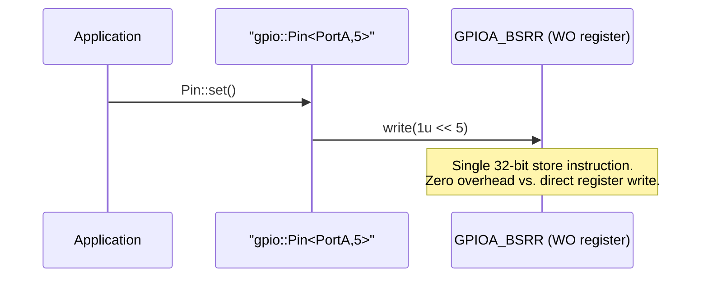

# Step 8 – First Concrete Platform: STM32U0 GPIO

**Goal:** A full STM32U083 partial specialisation of `ohal::gpio::Pin<Port, PinNum>`.

## Inputs Required

- MCU family: STM32U0
- MCU model: STM32U083
- GPIO register base addresses and offsets: listed in
  [Step 6](step-06-mcu-selection.md)
- Peripheral capability facts:
  - All STM32U083 GPIO pins support: Input, Output Push-Pull, Output Open-Drain, Alternate
    Function, Analog
  - BSRR is write-only (bits 0–15 set output high, bits 16–31 set output low)
  - IDR is read-only
  - MODER, OTYPER, OSPEEDR, PUPDR, ODR, AFRL, AFRH are read-write

## Sequence — "set GPIO pin high" on STM32U083



## Implementation Skeleton (`stm32u083/gpio.hpp`)

```cpp
// platforms/stm32u0/models/stm32u083/gpio.hpp
#ifndef OHAL_PLATFORMS_STM32U0_MODELS_STM32U083_GPIO_HPP
#define OHAL_PLATFORMS_STM32U0_MODELS_STM32U083_GPIO_HPP

#include "ohal/core/register.hpp"
#include "ohal/core/field.hpp"
#include "ohal/gpio.hpp"

namespace ohal::gpio {

// Partial specialisation for PortA
template <uint8_t PinNum>
struct Pin<PortA, PinNum> {
    static_assert(PinNum < 16u, "ohal: STM32U083 GPIOA has pins 0-15 only.");

    using MODER  = core::BitField<
        core::Register<0x42020000u>, PinNum * 2u, 2u,
        core::Access::ReadWrite, PinMode>;
    using OTYPER = core::BitField<
        core::Register<0x42020004u>, PinNum, 1u,
        core::Access::ReadWrite, OutputType>;
    using OSPEEDR = core::BitField<
        core::Register<0x42020008u>, PinNum * 2u, 2u,
        core::Access::ReadWrite, Speed>;
    using PUPDR  = core::BitField<
        core::Register<0x4202000Cu>, PinNum * 2u, 2u,
        core::Access::ReadWrite, Pull>;
    using IDR    = core::BitField<
        core::Register<0x42020010u>, PinNum, 1u,
        core::Access::ReadOnly, Level>;
    using ODR    = core::BitField<
        core::Register<0x42020014u>, PinNum, 1u,
        core::Access::ReadWrite, Level>;
    // BSRR: bits 0-15 = set high, bits 16-31 = set low; modelled as two write-only fields
    using BSRR_SET   = core::BitField<
        core::Register<0x42020018u>, PinNum,       1u, core::Access::WriteOnly>;
    using BSRR_RESET = core::BitField<
        core::Register<0x42020018u>, PinNum + 16u, 1u, core::Access::WriteOnly>;

    static void set_mode(PinMode mode) noexcept        { MODER::write(mode); }
    static void set_output_type(OutputType t) noexcept { OTYPER::write(t); }
    static void set_speed(Speed s) noexcept            { OSPEEDR::write(s); }
    static void set_pull(Pull p) noexcept              { PUPDR::write(p); }
    static void set()   noexcept { BSRR_SET::write(1u); }
    static void clear() noexcept { BSRR_RESET::write(1u); }
    static Level read_input()  noexcept { return IDR::read(); }
    static Level read_output() noexcept { return ODR::read(); }
    static void toggle() noexcept {
        if (read_output() == Level::Low) set();
        else clear();
    }
};

// Repeat for PortB ... PortF (identical structure, different base address)
// PortB base: 0x42020400, PortC: 0x42020800, PortD: 0x42020C00,
// PortE: 0x42021000, PortF: 0x42021400

} // namespace ohal::gpio

#endif // OHAL_PLATFORMS_STM32U0_MODELS_STM32U083_GPIO_HPP
```

## Capability Specialisations (`stm32u083/capabilities.hpp`)

```cpp
// platforms/stm32u0/models/stm32u083/capabilities.hpp
#ifndef OHAL_PLATFORMS_STM32U0_MODELS_STM32U083_CAPABILITIES_HPP
#define OHAL_PLATFORMS_STM32U0_MODELS_STM32U083_CAPABILITIES_HPP

#include "ohal/core/capabilities.hpp"

namespace ohal::gpio::capabilities {

// All STM32U083 GPIO pins support all four capability traits
template <typename Port, uint8_t PinNum>
struct supports_output_type<Port, PinNum>     : std::true_type {};

template <typename Port, uint8_t PinNum>
struct supports_output_speed<Port, PinNum>    : std::true_type {};

template <typename Port, uint8_t PinNum>
struct supports_pull<Port, PinNum>            : std::true_type {};

template <typename Port, uint8_t PinNum>
struct supports_alternate_function<Port, PinNum> : std::true_type {};

} // namespace ohal::gpio::capabilities

#endif // OHAL_PLATFORMS_STM32U0_MODELS_STM32U083_CAPABILITIES_HPP
```

## Tests to Write (host)

- `Pin<PortA, 5>::set()` writes `(1u << 5)` to the BSRR address (mock register memory).
- `Pin<PortA, 5>::clear()` writes `(1u << 21)` to BSRR.
- `Pin<PortA, 5>::set_mode(PinMode::Output)` writes `0b01` to MODER bits 11:10.
- `Pin<PortA, 5>::read_input()` reads bit 5 of IDR.
- Writing to `IDR` (a read-only field) fails to compile (negative-compile test).
