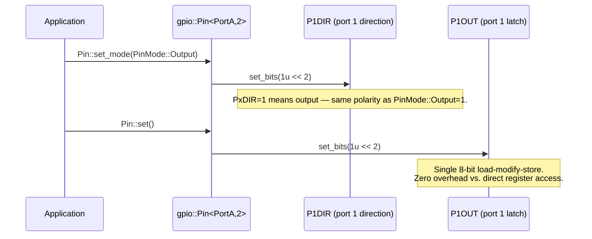

# Step 9 – First Non-ARM Platform: TI MSP430FR2355 GPIO

**Goal:** Implement GPIO for a non-ARM MCU to prove the architecture delivers true cross-platform
consistency. The MSP430FR2355 uses a 16-bit non-ARM RISC core, 8-bit-accessible GPIO registers,
and a fundamentally different GPIO register layout from the STM32U0.

## Why MSP430FR2355 Demonstrates the Architecture's Power

| Property           | STM32U083 (ARM Cortex-M0+)        | MSP430FR2355 (TI MSP430)                               |
| ------------------ | --------------------------------- | ------------------------------------------------------ |
| Architecture       | 32-bit ARM Cortex-M0+             | 16-bit MSP430 RISC (non-ARM)                           |
| Toolchain (target) | `arm-none-eabi-g++`               | `msp430-elf-g++`                                       |
| Register width     | 32-bit (`uint32_t`)               | 8-bit per port (`uint8_t`)                             |
| GPIO direction     | `MODER` (2 bits/pin)              | `PxDIR` (1 bit/pin; 1=output, 0=input — same polarity) |
| GPIO output        | `BSRR` (atomic set/reset, WO)     | `PxOUT` (output latch, read-write)                     |
| GPIO input         | `IDR` (RO)                        | `PxIN` (reads actual pin state, RO)                    |
| Pull resistors     | `PUPDR` (per-pin, 2 bits)         | `PxREN` (enable) + `PxOUT` (up/down selection)         |
| Output type        | `OTYPER` (push-pull / open-drain) | Not supported — compile error                          |
| Output speed       | `OSPEEDR`                         | Not supported — compile error                          |
| Alternate function | `AFRL`/`AFRH`                     | `PxSEL0` + `PxSEL1` (2-bit function select per pin)    |

The same application-level API (`set()`, `clear()`, `toggle()`, `read_input()`, `set_mode()`,
`set_pull()`) works unchanged. Calls to unsupported features (`set_speed()`, `set_output_type()`)
produce a `static_assert` compile error with a helpful message.

## Inputs Required

- MCU family define: `OHAL_FAMILY_MSP430FR2XX`
- MCU model define: `OHAL_MODEL_MSP430FR2355`
- MCU architecture: 16-bit MSP430 RISC (non-ARM, von Neumann)
- Register width: 8-bit per port register (`uint8_t`)
- Compiler (target builds): `msp430-elf-g++`
- MCU peripheral features: GPIO with PxIN (input), PxOUT (output latch), PxDIR (direction),
  PxREN (pull resistor enable), PxSEL0/PxSEL1 (alternate function); 1 bit per pin
- MCU peripheral register memory map (MSP430FR2355 datasheet SLASE54):

| Register | Address  | Access | Description                            |
| -------- | -------- | ------ | -------------------------------------- |
| P1IN     | `0x0200` | RO     | Pin input state — port 1               |
| P2IN     | `0x0201` | RO     | Pin input state — port 2               |
| P1OUT    | `0x0202` | RW     | Output latch — port 1                  |
| P2OUT    | `0x0203` | RW     | Output latch — port 2                  |
| P1DIR    | `0x0204` | RW     | Direction — port 1 (1=output, 0=input) |
| P2DIR    | `0x0205` | RW     | Direction — port 2                     |
| P1REN    | `0x0206` | RW     | Resistor enable — port 1 (1=enabled)   |
| P2REN    | `0x0207` | RW     | Resistor enable — port 2               |
| P1SEL0   | `0x020A` | RW     | Function select bit 0 — port 1         |
| P2SEL0   | `0x020B` | RW     | Function select bit 0 — port 2         |
| P1SEL1   | `0x020C` | RW     | Function select bit 1 — port 1         |
| P2SEL1   | `0x020D` | RW     | Function select bit 1 — port 2         |
| P3IN     | `0x0220` | RO     | Pin input state — port 3               |
| P4IN     | `0x0221` | RO     | Pin input state — port 4               |
| P3OUT    | `0x0222` | RW     | Output latch — port 3                  |
| P4OUT    | `0x0223` | RW     | Output latch — port 4                  |
| P3DIR    | `0x0224` | RW     | Direction — port 3                     |
| P4DIR    | `0x0225` | RW     | Direction — port 4                     |
| P3REN    | `0x0226` | RW     | Resistor enable — port 3               |
| P4REN    | `0x0227` | RW     | Resistor enable — port 4               |
| P3SEL0   | `0x022A` | RW     | Function select bit 0 — port 3         |
| P4SEL0   | `0x022B` | RW     | Function select bit 0 — port 4         |
| P3SEL1   | `0x022C` | RW     | Function select bit 1 — port 3         |
| P4SEL1   | `0x022D` | RW     | Function select bit 1 — port 4         |
| P5IN     | `0x0240` | RO     | Pin input state — port 5               |
| P6IN     | `0x0241` | RO     | Pin input state — port 6               |
| P5OUT    | `0x0242` | RW     | Output latch — port 5                  |
| P6OUT    | `0x0243` | RW     | Output latch — port 6                  |
| P5DIR    | `0x0244` | RW     | Direction — port 5                     |
| P6DIR    | `0x0245` | RW     | Direction — port 6                     |
| P5REN    | `0x0246` | RW     | Resistor enable — port 5               |
| P6REN    | `0x0247` | RW     | Resistor enable — port 6               |
| P5SEL0   | `0x024A` | RW     | Function select bit 0 — port 5         |
| P6SEL0   | `0x024B` | RW     | Function select bit 0 — port 6         |
| P5SEL1   | `0x024C` | RW     | Function select bit 1 — port 5         |
| P6SEL1   | `0x024D` | RW     | Function select bit 1 — port 6         |

**Note on pull resistors:** When `PxREN` bit N is set and `PxDIR` bit N is 0 (input), `PxOUT`
bit N selects the pull direction: `1` = pull-up, `0` = pull-down.

## Sequence — "set GPIO pin high" on MSP430FR2355



## `msp430fr2xx/family.hpp` Logic

```cpp
// platforms/msp430fr2xx/family.hpp
#ifndef OHAL_PLATFORMS_MSP430FR2XX_FAMILY_HPP
#define OHAL_PLATFORMS_MSP430FR2XX_FAMILY_HPP

#if !defined(OHAL_MODEL_MSP430FR2355) /* … list all supported MSP430FR2xx models … */
  #error "ohal: No MSP430FR2xx model defined. " \
         "Pass -DOHAL_MODEL_MSP430FR2355 (or another MSP430FR2xx model) to the compiler."
#endif

#if defined(OHAL_MODEL_MSP430FR2355)
  #include "ohal/platforms/msp430fr2xx/models/msp430fr2355/gpio.hpp"
  #include "ohal/platforms/msp430fr2xx/models/msp430fr2355/capabilities.hpp"
#endif

#endif // OHAL_PLATFORMS_MSP430FR2XX_FAMILY_HPP
```

## Implementation Skeleton (`msp430fr2355/gpio.hpp`)

Key differences from the STM32U083 specialisation:

- All GPIO registers are `uint8_t` wide (1 byte per port per register type).
- Direction polarity is the **same** as the `PinMode` enum: `PxDIR=1` means output, `PxDIR=0`
  means input. No inversion is needed.
- Output is written via `PxOUT` (read-modify-write, unlike STM32 BSRR).
- Input is read via `PxIN`.
- Pull resistors are supported: `PxREN=1` enables the resistor; `PxOUT` selects direction.
- Output type (push-pull / open-drain) is not configurable — fires a `static_assert`.
- Output speed is not configurable — fires a `static_assert`.

```cpp
// platforms/msp430fr2xx/models/msp430fr2355/gpio.hpp
#ifndef OHAL_PLATFORMS_MSP430FR2XX_MODELS_MSP430FR2355_GPIO_HPP
#define OHAL_PLATFORMS_MSP430FR2XX_MODELS_MSP430FR2355_GPIO_HPP

#include <cstdint>
#include "ohal/core/register.hpp"
#include "ohal/core/field.hpp"
#include "ohal/gpio.hpp"
#include "ohal/platforms/msp430fr2xx/models/msp430fr2355/capabilities.hpp"

namespace ohal::gpio {

// All MSP430FR2355 GPIO port registers are 8-bit.
// Register<Addr, uint8_t> is used throughout.

template <uint8_t PinNum>
struct Pin<PortA, PinNum> {
    static_assert(PinNum < 8u, "ohal: MSP430FR2355 Port 1 has pins 0-7 only.");

    // Direction: P1DIR bit N. 1=output, 0=input (same polarity as PinMode enum).
    using DIR_BIT = core::BitField<
        core::Register<0x0204u, uint8_t>, PinNum, 1u, core::Access::ReadWrite>;

    // Output latch: P1OUT bit N.
    using OUT_BIT = core::BitField<
        core::Register<0x0202u, uint8_t>, PinNum, 1u, core::Access::ReadWrite, Level>;

    // Input: P1IN bit N. Read the actual pin state here.
    using IN_BIT = core::BitField<
        core::Register<0x0200u, uint8_t>, PinNum, 1u, core::Access::ReadOnly, Level>;

    // Pull resistor enable: P1REN bit N. 1=resistor enabled.
    using REN_BIT = core::BitField<
        core::Register<0x0206u, uint8_t>, PinNum, 1u, core::Access::ReadWrite>;

    // set_mode: PinMode::Output -> DIR=1, PinMode::Input -> DIR=0 (no inversion needed).
    static void set_mode(PinMode mode) noexcept {
        DIR_BIT::write(static_cast<uint8_t>(mode == PinMode::Output ? 1u : 0u));
    }

    static void set()   noexcept { OUT_BIT::write(Level::High); }
    static void clear() noexcept { OUT_BIT::write(Level::Low);  }
    static Level read_input()  noexcept { return IN_BIT::read();  }
    static Level read_output() noexcept { return OUT_BIT::read(); }
    static void toggle() noexcept {
        if (read_output() == Level::Low) set();
        else clear();
    }

    // set_pull: enable PxREN and set PxOUT to select up (1) or down (0).
    static void set_pull(Pull pull) noexcept {
        static_assert(capabilities::supports_pull<PortA, PinNum>::value,
            "ohal: MSP430FR2355 GPIO pull configuration requires this trait to be true.");
        if (pull == Pull::None) {
            REN_BIT::write(0u);
        } else {
            OUT_BIT::write(pull == Pull::Up ? static_cast<uint8_t>(1u)
                                            : static_cast<uint8_t>(0u));
            REN_BIT::write(1u);
        }
    }

    // Unsupported features: static_assert fires at call site using capability traits.
    static void set_output_type(OutputType) noexcept {
        static_assert(capabilities::supports_output_type<PortA, PinNum>::value,
            "ohal: MSP430FR2355 GPIO does not support configurable output type.");
    }
    static void set_speed(Speed) noexcept {
        static_assert(capabilities::supports_output_speed<PortA, PinNum>::value,
            "ohal: MSP430FR2355 GPIO does not support configurable output speed.");
    }
};

// Repeat for PortB ... PortF with their respective PxIN/PxOUT/PxDIR/PxREN addresses.
// PortB (P2, 8 pins): IN=0x0201, OUT=0x0203, DIR=0x0205, REN=0x0207, PinNum < 8
// PortC (P3, 8 pins): IN=0x0220, OUT=0x0222, DIR=0x0224, REN=0x0226, PinNum < 8
// PortD (P4, 8 pins): IN=0x0221, OUT=0x0223, DIR=0x0225, REN=0x0227, PinNum < 8
// PortE (P5, 8 pins): IN=0x0240, OUT=0x0242, DIR=0x0244, REN=0x0246, PinNum < 8
// PortF (P6, 8 pins): IN=0x0241, OUT=0x0243, DIR=0x0245, REN=0x0247, PinNum < 8

} // namespace ohal::gpio

#endif // OHAL_PLATFORMS_MSP430FR2XX_MODELS_MSP430FR2355_GPIO_HPP
```

## Capability Specialisations (`msp430fr2355/capabilities.hpp`)

```cpp
// platforms/msp430fr2xx/models/msp430fr2355/capabilities.hpp
#ifndef OHAL_PLATFORMS_MSP430FR2XX_MODELS_MSP430FR2355_CAPABILITIES_HPP
#define OHAL_PLATFORMS_MSP430FR2XX_MODELS_MSP430FR2355_CAPABILITIES_HPP

#include <type_traits>
#include "ohal/core/capabilities.hpp"

namespace ohal::gpio::capabilities {

// MSP430FR2355 supports pull resistors on all ports and pins.
template <typename Port, uint8_t PinNum>
struct supports_pull<Port, PinNum> : std::true_type {};

// MSP430FR2355 does not support configurable output type or output speed.
// The default false_type primary templates already handle those correctly.

} // namespace ohal::gpio::capabilities

#endif // OHAL_PLATFORMS_MSP430FR2XX_MODELS_MSP430FR2355_CAPABILITIES_HPP
```

## Approach

1. Add `platforms/msp430fr2xx/family.hpp` — validates model define; errors with a clear message
   if none is supplied.
2. Add `platforms/msp430fr2xx/models/msp430fr2355/gpio.hpp` — partial specialisations using
   `uint8_t` registers with `PxIN`/`PxOUT`/`PxDIR`/`PxREN` layout.
3. Add `platforms/msp430fr2xx/models/msp430fr2355/capabilities.hpp` — specialises
   `supports_pull` to `true_type`; all other traits remain `false_type` (default).
4. Application code using `ohal::gpio::Pin<PortA, 2>` for basic `set()`/`clear()`/`toggle()`
   compiles unchanged.
5. Application code calling `set_speed()` or `set_output_type()` on an MSP430FR2355 target fails
   with a clear compile-time error message.
6. Run the same `set()`/`clear()`/`toggle()`/`read_input()`/`set_pull()` host tests against
   MSP430FR2355 mock registers (8-bit `mock_memory` array via `mock_addr8()`).

## Tests to Write (host)

- `Pin<PortA, 2>::set()` calls `OUT_BIT::write(Level::High)` — verifies bit 2 of P1OUT mock slot
  is set.
- `Pin<PortA, 2>::clear()` — verifies bit 2 of P1OUT mock slot is cleared.
- `Pin<PortA, 2>::set_mode(PinMode::Output)` — verifies bit 2 of P1DIR mock slot is set
  (`DIR=1` for output).
- `Pin<PortA, 2>::set_mode(PinMode::Input)` — verifies bit 2 of P1DIR mock slot is cleared
  (`DIR=0` for input).
- `Pin<PortA, 2>::read_input()` — reads P1IN mock slot, returns correct `Level`.
- `Pin<PortA, 2>::set_pull(Pull::Up)` — verifies P1REN bit 2 is set and P1OUT bit 2 is set.
- `Pin<PortA, 2>::set_pull(Pull::Down)` — verifies P1REN bit 2 is set and P1OUT bit 2 is
  cleared.
- `Pin<PortA, 2>::set_pull(Pull::None)` — verifies P1REN bit 2 is cleared.
- `Pin<PortA, 2>::set_speed(Speed::High)` fails to compile with message
  `MSP430FR2355 GPIO does not support configurable output speed` (negative-compile test).
- `Pin<PortA, 2>::set_output_type(OutputType::OpenDrain)` fails to compile with message
  `MSP430FR2355 GPIO does not support configurable output type` (negative-compile test).
