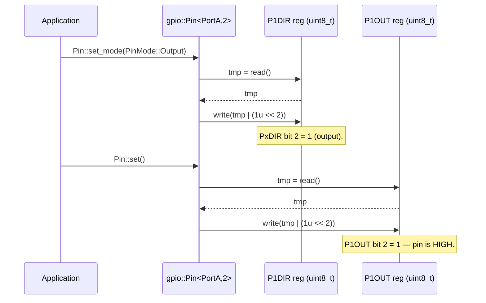

# Step 9 – First Non-ARM Platform: TI MSP430FR2355 GPIO

**Goal:** Implement GPIO for a non-ARM MCU to prove the architecture delivers true cross-platform
consistency. The MSP430FR2355 uses a 16-bit non-ARM RISC core, 8-bit-accessible GPIO registers,
and a fundamentally different GPIO register layout from the STM32U0.

## Why MSP430FR2355 Demonstrates the Architecture's Power

| Property           | STM32U083 (ARM Cortex-M0+)        | MSP430FR2355 (TI MSP430)                               |
| ------------------ | --------------------------------- | ------------------------------------------------------ |
| Architecture       | 32-bit ARM Cortex-M0+             | 16-bit MSP430 RISC (non-ARM)                           |
| Toolchain (target) | `arm-none-eabi-g++`               | `msp430-elf-g++`                                       |
| Register width     | 32-bit (`uint32_t`)               | 8-bit per port (`uint8_t`)                             |
| GPIO direction     | `MODER` (2 bits/pin)              | `PxDIR` (1 bit/pin; 1=output, 0=input — same polarity) |
| GPIO output        | `BSRR` (atomic set/reset, WO)     | `PxOUT` (output latch, read-write)                     |
| GPIO input         | `IDR` (RO)                        | `PxIN` (reads actual pin state, RO)                    |
| Pull resistors     | `PUPDR` (per-pin, 2 bits)         | `PxREN` (enable) + `PxOUT` (up/down selection)         |
| Output type        | `OTYPER` (push-pull / open-drain) | Not supported — compile error                          |
| Output speed       | `OSPEEDR`                         | Not supported — compile error                          |
| Alternate function | `AFRL`/`AFRH`                     | `PxSEL0` + `PxSEL1` (2-bit function select per pin)    |

The same application-level API (`set()`, `clear()`, `toggle()`, `read_input()`, `set_mode()`,
`set_pull()`) works unchanged. Calls to unsupported features (`set_speed()`, `set_output_type()`)
produce a `static_assert` compile error with a helpful message.

## Inputs Required

- MCU family define: `OHAL_FAMILY_MSP430FR2XX`
- MCU model define: `OHAL_MODEL_MSP430FR2355`
- MCU architecture: 16-bit MSP430 RISC (non-ARM, von Neumann)
- Register width: 8-bit per port register (`uint8_t`)
- Compiler (target builds): `msp430-elf-g++`
- MCU peripheral features: GPIO with PxIN (input), PxOUT (output latch), PxDIR (direction),
  PxREN (pull resistor enable), PxSEL0/PxSEL1 (alternate function); 1 bit per pin
- MCU peripheral register memory map (MSP430FR2355 datasheet SLASE54):

| Register | Address  | Access | Description                            |
| -------- | -------- | ------ | -------------------------------------- |
| P1IN     | `0x0200` | RO     | Pin input state — port 1               |
| P2IN     | `0x0201` | RO     | Pin input state — port 2               |
| P1OUT    | `0x0202` | RW     | Output latch — port 1                  |
| P2OUT    | `0x0203` | RW     | Output latch — port 2                  |
| P1DIR    | `0x0204` | RW     | Direction — port 1 (1=output, 0=input) |
| P2DIR    | `0x0205` | RW     | Direction — port 2                     |
| P1REN    | `0x0206` | RW     | Resistor enable — port 1 (1=enabled)   |
| P2REN    | `0x0207` | RW     | Resistor enable — port 2               |
| P1SEL0   | `0x020A` | RW     | Function select bit 0 — port 1         |
| P2SEL0   | `0x020B` | RW     | Function select bit 0 — port 2         |
| P1SEL1   | `0x020C` | RW     | Function select bit 1 — port 1         |
| P2SEL1   | `0x020D` | RW     | Function select bit 1 — port 2         |
| P3IN     | `0x0220` | RO     | Pin input state — port 3               |
| P4IN     | `0x0221` | RO     | Pin input state — port 4               |
| P3OUT    | `0x0222` | RW     | Output latch — port 3                  |
| P4OUT    | `0x0223` | RW     | Output latch — port 4                  |
| P3DIR    | `0x0224` | RW     | Direction — port 3                     |
| P4DIR    | `0x0225` | RW     | Direction — port 4                     |
| P3REN    | `0x0226` | RW     | Resistor enable — port 3               |
| P4REN    | `0x0227` | RW     | Resistor enable — port 4               |
| P3SEL0   | `0x022A` | RW     | Function select bit 0 — port 3         |
| P4SEL0   | `0x022B` | RW     | Function select bit 0 — port 4         |
| P3SEL1   | `0x022C` | RW     | Function select bit 1 — port 3         |
| P4SEL1   | `0x022D` | RW     | Function select bit 1 — port 4         |
| P5IN     | `0x0240` | RO     | Pin input state — port 5               |
| P6IN     | `0x0241` | RO     | Pin input state — port 6               |
| P5OUT    | `0x0242` | RW     | Output latch — port 5                  |
| P6OUT    | `0x0243` | RW     | Output latch — port 6                  |
| P5DIR    | `0x0244` | RW     | Direction — port 5                     |
| P6DIR    | `0x0245` | RW     | Direction — port 6                     |
| P5REN    | `0x0246` | RW     | Resistor enable — port 5               |
| P6REN    | `0x0247` | RW     | Resistor enable — port 6               |
| P5SEL0   | `0x024A` | RW     | Function select bit 0 — port 5         |
| P6SEL0   | `0x024B` | RW     | Function select bit 0 — port 6         |
| P5SEL1   | `0x024C` | RW     | Function select bit 1 — port 5         |
| P6SEL1   | `0x024D` | RW     | Function select bit 1 — port 6         |

**Note on pull resistors:** When `PxREN` bit N is set and `PxDIR` bit N is 0 (input), `PxOUT`
bit N selects the pull direction: `1` = pull-up, `0` = pull-down.

**Note on alternate function:** `PxSEL1:PxSEL0 = 00` selects GPIO. `01` selects the primary
peripheral function, `10` the secondary, and `11` the tertiary. `PinMode::Analog` is not a
distinct MSP430 GPIO mode; analogue inputs are selected via the ADC module, not via GPIO
direction registers. Calling `set_mode(PinMode::Analog)` on this platform fires a
`static_assert`.

## Sequence — "set GPIO pin high" on MSP430FR2355

The `Register<>` abstraction exposes only `read()` and `write()` (single volatile bus
transactions). There is no `set_bits()` helper; every read-modify-write is explicit.



## `msp430fr2xx/family.hpp` Logic

```cpp
// platforms/msp430fr2xx/family.hpp
#ifndef OHAL_PLATFORMS_MSP430FR2XX_FAMILY_HPP
#define OHAL_PLATFORMS_MSP430FR2XX_FAMILY_HPP

#if !defined(OHAL_MODEL_MSP430FR2355) /* … list all supported MSP430FR2xx models … */
  #error "ohal: No MSP430FR2xx model defined. " \
         "Pass -DOHAL_MODEL_MSP430FR2355 (or another MSP430FR2xx model) to the compiler."
#endif

#if defined(OHAL_MODEL_MSP430FR2355)
  #include "ohal/platforms/msp430fr2xx/models/msp430fr2355/gpio.hpp"
  #include "ohal/platforms/msp430fr2xx/models/msp430fr2355/capabilities.hpp"
#endif

#endif // OHAL_PLATFORMS_MSP430FR2XX_FAMILY_HPP
```

## Implementation Skeleton (`msp430fr2355/gpio.hpp`)

Key differences from the STM32U083 specialisation:

- All GPIO registers are `uint8_t` wide (1 byte per port per register type).
- Direction polarity is the **same** as the `PinMode` enum: `PxDIR=1` means output, `PxDIR=0`
  means input. No inversion is needed.
- Output is written via `PxOUT` (read-modify-write, unlike STM32 BSRR).
- Input is read via `PxIN`.
- Pull resistors are supported: `PxREN=1` enables the resistor; `PxOUT` selects direction.
- Alternate function is supported via `PxSEL0`/`PxSEL1` — `set_mode(AlternateFunction)` sets
  `PxSEL0=1, PxSEL1=0` (primary peripheral function).
- `PinMode::Analog` is not a distinct GPIO mode on MSP430 — fires a `static_assert`.
- Output type (push-pull / open-drain) is not configurable — fires a `static_assert`.
- Output speed is not configurable — fires a `static_assert`.
- Host tests inject a mock `Regs` type (see the `Regs` template parameter below) so that register
  accesses are redirected into `ohal::test::MockRegister<uint8_t, &storage>` backing variables
  without modifying the real hardware header, following the same pattern as STM32U083.

### Register set and `GpioPortPinImpl`

```cpp
// platforms/msp430fr2xx/models/msp430fr2355/gpio.hpp
#ifndef OHAL_PLATFORMS_MSP430FR2XX_MODELS_MSP430FR2355_GPIO_HPP
#define OHAL_PLATFORMS_MSP430FR2XX_MODELS_MSP430FR2355_GPIO_HPP

#include <cstdint>
#include "ohal/core/access.hpp"
#include "ohal/core/field.hpp"
#include "ohal/core/register.hpp"
#include "ohal/gpio.hpp"
#include "ohal/platforms/msp430fr2xx/models/msp430fr2355/capabilities.hpp"

namespace ohal::platforms::msp430fr2xx::msp430fr2355 {

/// Number of pins per MSP430FR2355 GPIO port (0–7).
inline constexpr uint8_t kMsp430fr2355PinCount = 8U;

/// Register types for one MSP430FR2355 8-bit GPIO port.
/// Parameterised on six independent 8-bit register addresses (each port has
/// distinct non-contiguous addresses — see register map table above).
template <uintptr_t InAddr, uintptr_t OutAddr, uintptr_t DirAddr,
          uintptr_t RenAddr, uintptr_t Sel0Addr, uintptr_t Sel1Addr>
struct GpioPortRegs {
  using In   = core::Register<InAddr,   uint8_t>; ///< PxIN  (RO)
  using Out  = core::Register<OutAddr,  uint8_t>; ///< PxOUT (RW)
  using Dir  = core::Register<DirAddr,  uint8_t>; ///< PxDIR (RW)
  using Ren  = core::Register<RenAddr,  uint8_t>; ///< PxREN (RW)
  using Sel0 = core::Register<Sel0Addr, uint8_t>; ///< PxSEL0 (RW)
  using Sel1 = core::Register<Sel1Addr, uint8_t>; ///< PxSEL1 (RW)
};

// Named register sets for each port using the SLASE54 addresses.
using GpioP1Regs = GpioPortRegs<0x0200u, 0x0202u, 0x0204u, 0x0206u, 0x020Au, 0x020Cu>;
using GpioP2Regs = GpioPortRegs<0x0201u, 0x0203u, 0x0205u, 0x0207u, 0x020Bu, 0x020Du>;
using GpioP3Regs = GpioPortRegs<0x0220u, 0x0222u, 0x0224u, 0x0226u, 0x022Au, 0x022Cu>;
using GpioP4Regs = GpioPortRegs<0x0221u, 0x0223u, 0x0225u, 0x0227u, 0x022Bu, 0x022Du>;
using GpioP5Regs = GpioPortRegs<0x0240u, 0x0242u, 0x0244u, 0x0246u, 0x024Au, 0x024Cu>;
using GpioP6Regs = GpioPortRegs<0x0241u, 0x0243u, 0x0245u, 0x0247u, 0x024Bu, 0x024Du>;

/// Implements the ohal::gpio::Pin<Port, PinNum> API for one MSP430FR2355 GPIO port.
///
/// Parameterised on @p Regs so that host-side tests can inject a mock register set
/// (using ohal::test::MockRegister types) without modifying the real hardware header.
/// Production code uses GpioP1Regs…GpioP6Regs as the @p Regs argument.
///
/// @tparam PinNum  Zero-based pin number within the port (0–7).
/// @tparam Regs    A type whose nested type aliases (In, Out, Dir, Ren, Sel0, Sel1)
///                 satisfy the ohal::core::Register or MockRegister interface.
template <uint8_t PinNum, typename Regs>
struct GpioPortPinImpl {
  static_assert(PinNum < kMsp430fr2355PinCount,
      "ohal: MSP430FR2355 GPIO ports have pins 0-7 only.");

  // Bit-field descriptors — 1 bit per pin.
  using DirBit  = core::BitField<typename Regs::Dir,  PinNum, 1U, core::Access::ReadWrite>;
  using OutBit  = core::BitField<typename Regs::Out,  PinNum, 1U, core::Access::ReadWrite,
                                 gpio::Level>;
  using InBit   = core::BitField<typename Regs::In,   PinNum, 1U, core::Access::ReadOnly,
                                 gpio::Level>;
  using RenBit  = core::BitField<typename Regs::Ren,  PinNum, 1U, core::Access::ReadWrite>;
  using Sel0Bit = core::BitField<typename Regs::Sel0, PinNum, 1U, core::Access::ReadWrite>;
  using Sel1Bit = core::BitField<typename Regs::Sel1, PinNum, 1U, core::Access::ReadWrite>;

  /// set_mode maps all four PinMode values explicitly:
  ///   Input            → DIR=0, SEL0=0, SEL1=0 (GPIO input)
  ///   Output           → DIR=1, SEL0=0, SEL1=0 (GPIO output)
  ///   AlternateFunction→ SEL0=1, SEL1=0 (primary AF; DIR set by peripheral)
  ///   Analog           → not a distinct MSP430 GPIO mode; compile error.
  static void set_mode(gpio::PinMode mode) noexcept {
    static_assert(mode != gpio::PinMode::Analog || sizeof(Regs) == 0,
        "ohal: MSP430FR2355 GPIO does not have an Analog pin mode. "
        "Use AlternateFunction and configure the ADC module separately.");
    if (mode == gpio::PinMode::Output) {
      DirBit::write(1U);
      Sel0Bit::write(0U);
      Sel1Bit::write(0U);
    } else if (mode == gpio::PinMode::AlternateFunction) {
      // Primary peripheral function: SEL1:SEL0 = 0b01. Direction is
      // controlled by the selected peripheral, not written here.
      Sel0Bit::write(1U);
      Sel1Bit::write(0U);
    } else { // PinMode::Input (and PinMode::Analog blocked above)
      DirBit::write(0U);
      Sel0Bit::write(0U);
      Sel1Bit::write(0U);
    }
  }

  static void set()   noexcept { OutBit::write(gpio::Level::High); }
  static void clear() noexcept { OutBit::write(gpio::Level::Low);  }
  [[nodiscard]] static gpio::Level read_input()  noexcept { return InBit::read();  }
  [[nodiscard]] static gpio::Level read_output() noexcept { return OutBit::read(); }

  static void toggle() noexcept {
    if (read_output() == gpio::Level::Low) set();
    else clear();
  }

  /// set_pull: enable PxREN and use PxOUT to select up/down.
  /// Requires PxDIR=0 (input); call set_mode(Input) before set_pull().
  static void set_pull(gpio::Pull pull) noexcept {
    if (pull == gpio::Pull::None) {
      RenBit::write(0U);
    } else {
      OutBit::write(pull == gpio::Pull::Up ? 1U : 0U);
      RenBit::write(1U);
    }
  }

  // Unsupported features: static_assert fires at call site.
  static void set_output_type(gpio::OutputType) noexcept {
    static_assert(capabilities::supports_output_type<gpio::PortA, PinNum>::value,
        "ohal: MSP430FR2355 GPIO does not support configurable output type.");
  }
  static void set_speed(gpio::Speed) noexcept {
    static_assert(capabilities::supports_output_speed<gpio::PortA, PinNum>::value,
        "ohal: MSP430FR2355 GPIO does not support configurable output speed.");
  }
};

} // namespace ohal::platforms::msp430fr2xx::msp430fr2355

namespace ohal::gpio {

// Pin<PortA…PortF, PinNum> partial specialisations delegate to GpioPortPinImpl.
template <uint8_t PinNum>
struct Pin<PortA, PinNum>
    : platforms::msp430fr2xx::msp430fr2355::GpioPortPinImpl<
          PinNum, platforms::msp430fr2xx::msp430fr2355::GpioP1Regs> {};

template <uint8_t PinNum>
struct Pin<PortB, PinNum>
    : platforms::msp430fr2xx::msp430fr2355::GpioPortPinImpl<
          PinNum, platforms::msp430fr2xx::msp430fr2355::GpioP2Regs> {};

// Repeat for PortC (GpioP3Regs), PortD (GpioP4Regs),
//           PortE (GpioP5Regs), PortF (GpioP6Regs).

} // namespace ohal::gpio

#endif // OHAL_PLATFORMS_MSP430FR2XX_MODELS_MSP430FR2355_GPIO_HPP
```

## Capability Specialisations (`msp430fr2355/capabilities.hpp`)

Capabilities follow the same per-port pattern as the STM32U083 implementation: a `detail`
helper evaluates to `true_type` only for valid pin numbers (0–7), so out-of-range pins correctly
report `false`.

```cpp
// platforms/msp430fr2xx/models/msp430fr2355/capabilities.hpp
#ifndef OHAL_PLATFORMS_MSP430FR2XX_MODELS_MSP430FR2355_CAPABILITIES_HPP
#define OHAL_PLATFORMS_MSP430FR2XX_MODELS_MSP430FR2355_CAPABILITIES_HPP

#include <type_traits>
#include "ohal/core/capabilities.hpp"

namespace ohal::gpio::capabilities {

namespace detail {
/// MSP430FR2355 GPIO ports have 8 pins (0–7).
inline constexpr uint8_t kMsp430fr2355PinCount = 8U;

/// Evaluates to true_type for valid pin numbers (0–7), false_type otherwise.
/// Used as the base for every MSP430FR2355 capability specialisation so that
/// out-of-range pin numbers correctly report false.
template <uint8_t PinNum>
using Msp430fr2355PortCapability = std::bool_constant<(PinNum < kMsp430fr2355PinCount)>;
} // namespace detail

// MSP430FR2355 supports pull resistors and alternate-function selection on all
// ports and pins 0–7.  Output type and output speed are not supported; the
// default false_type primary templates handle those.

// NOLINTBEGIN(readability-magic-numbers,cppcoreguidelines-avoid-magic-numbers)
template <uint8_t PinNum>
struct supports_pull<PortA, PinNum> : detail::Msp430fr2355PortCapability<PinNum> {};
template <uint8_t PinNum>
struct supports_pull<PortB, PinNum> : detail::Msp430fr2355PortCapability<PinNum> {};
template <uint8_t PinNum>
struct supports_pull<PortC, PinNum> : detail::Msp430fr2355PortCapability<PinNum> {};
template <uint8_t PinNum>
struct supports_pull<PortD, PinNum> : detail::Msp430fr2355PortCapability<PinNum> {};
template <uint8_t PinNum>
struct supports_pull<PortE, PinNum> : detail::Msp430fr2355PortCapability<PinNum> {};
template <uint8_t PinNum>
struct supports_pull<PortF, PinNum> : detail::Msp430fr2355PortCapability<PinNum> {};

template <uint8_t PinNum>
struct supports_alternate_function<PortA, PinNum> : detail::Msp430fr2355PortCapability<PinNum> {};
template <uint8_t PinNum>
struct supports_alternate_function<PortB, PinNum> : detail::Msp430fr2355PortCapability<PinNum> {};
template <uint8_t PinNum>
struct supports_alternate_function<PortC, PinNum> : detail::Msp430fr2355PortCapability<PinNum> {};
template <uint8_t PinNum>
struct supports_alternate_function<PortD, PinNum> : detail::Msp430fr2355PortCapability<PinNum> {};
template <uint8_t PinNum>
struct supports_alternate_function<PortE, PinNum> : detail::Msp430fr2355PortCapability<PinNum> {};
template <uint8_t PinNum>
struct supports_alternate_function<PortF, PinNum> : detail::Msp430fr2355PortCapability<PinNum> {};
// NOLINTEND(readability-magic-numbers,cppcoreguidelines-avoid-magic-numbers)

} // namespace ohal::gpio::capabilities

#endif // OHAL_PLATFORMS_MSP430FR2XX_MODELS_MSP430FR2355_CAPABILITIES_HPP
```

## Approach

1. Add `platforms/msp430fr2xx/family.hpp` — validates model define; errors with a clear message
   if none is supplied.
2. Add `platforms/msp430fr2xx/models/msp430fr2355/gpio.hpp` — defines `GpioPortRegs<…>` with
   six 8-bit register types, `GpioPortPinImpl<PinNum, Regs>` implementing the full GPIO API, and
   `Pin<PortA…PortF, PinNum>` partial specialisations that instantiate `GpioPortPinImpl` with the
   real hardware register types (`GpioP1Regs…GpioP6Regs`).
3. Add `platforms/msp430fr2xx/models/msp430fr2355/capabilities.hpp` — per-port specialisations of
   `supports_pull` and `supports_alternate_function` bounded by pin count (0–7); all other traits
   remain `false_type` (default).
4. Host tests instantiate `GpioPortPinImpl<PinNum, MockGpioRegs>` directly (where `MockGpioRegs`
   carries `ohal::test::MockRegister<uint8_t, &storage>` type aliases), following the same
   mock-injection pattern as STM32U083. No macro-based address override is needed.
5. Application code using `ohal::gpio::Pin<PortA, 2>` for basic `set()`/`clear()`/`toggle()`
   compiles unchanged.
6. Application code calling `set_speed()` or `set_output_type()` on an MSP430FR2355 target fails
   with a clear compile-time error message.

## Tests to Write (host)

Create `tests/host/test_gpio_msp430fr2355.cpp`. Instantiate
`GpioPortPinImpl<PinNum, MockGpioRegs>` with mock `uint8_t` backing variables, following the
STM32U083 test pattern.

**Positive tests (GPIO behaviour):**

- `GpioPortPinImpl<2, MockRegs>::set()` — verifies bit 2 of mock `Out` slot is set.
- `GpioPortPinImpl<2, MockRegs>::clear()` — verifies bit 2 of mock `Out` slot is cleared.
- `GpioPortPinImpl<2, MockRegs>::set_mode(PinMode::Output)` — verifies bit 2 of mock `Dir` slot
  is set and `Sel0`/`Sel1` bits are cleared.
- `GpioPortPinImpl<2, MockRegs>::set_mode(PinMode::Input)` — verifies bit 2 of mock `Dir` slot
  is cleared and `Sel0`/`Sel1` bits are cleared.
- `GpioPortPinImpl<2, MockRegs>::set_mode(PinMode::AlternateFunction)` — verifies `Sel0` bit 2
  is set and `Sel1` bit 2 is cleared.
- `GpioPortPinImpl<2, MockRegs>::read_input()` — reads mock `In` slot, returns correct `Level`.
- `GpioPortPinImpl<2, MockRegs>::set_pull(Pull::Up)` — verifies mock `Ren` bit 2 is set and
  mock `Out` bit 2 is set.
- `GpioPortPinImpl<2, MockRegs>::set_pull(Pull::Down)` — verifies mock `Ren` bit 2 is set and
  mock `Out` bit 2 is cleared.
- `GpioPortPinImpl<2, MockRegs>::set_pull(Pull::None)` — verifies mock `Ren` bit 2 is cleared.

**Capability trait tests:**

- `supports_pull<PortA, 0>::value == true` — valid pin.
- `supports_pull<PortA, 7>::value == true` — valid pin (boundary).
- `supports_pull<PortA, 8>::value == false` — out-of-range pin.
- `supports_alternate_function<PortA, 0>::value == true` — valid pin.
- `supports_alternate_function<PortA, 8>::value == false` — out-of-range pin.

**Negative-compile tests:**

- `GpioPortPinImpl<2, MockRegs>::set_speed(Speed::High)` — compile error:
  `MSP430FR2355 GPIO does not support configurable output speed`.
- `GpioPortPinImpl<2, MockRegs>::set_output_type(OutputType::OpenDrain)` — compile error:
  `MSP430FR2355 GPIO does not support configurable output type`.
- `GpioPortPinImpl<2, MockRegs>::set_mode(PinMode::Analog)` — compile error:
  `MSP430FR2355 GPIO does not have an Analog pin mode`.
