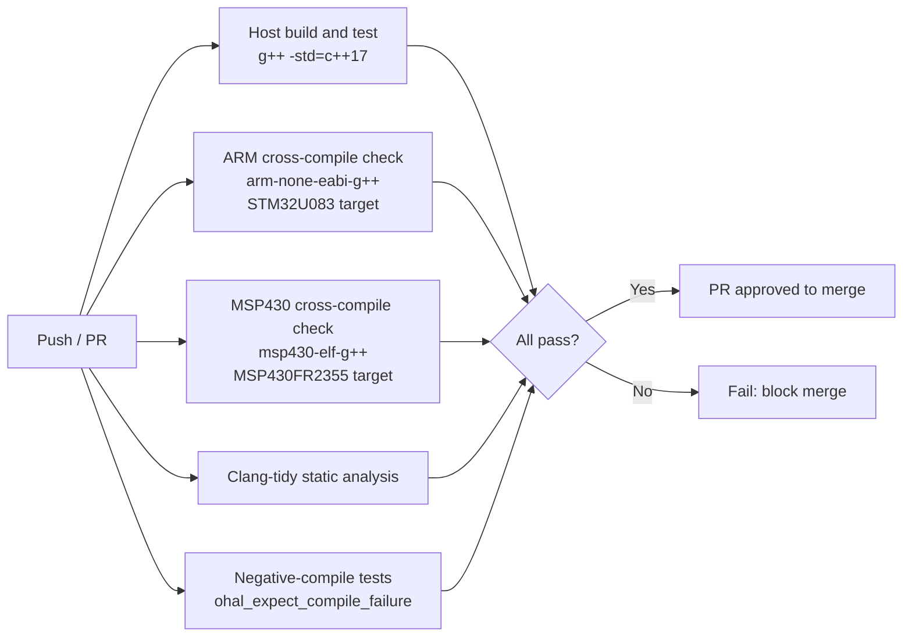

# Step 12 – CI / Continuous Integration

**Goal:** Automated build and test on every pull request.

## GitHub Actions Workflow Jobs

## Required Inputs for ARM Cross-Compile Check

- `arm-none-eabi-gcc` toolchain installed in the runner image.
- STM32U083 linker script (`.ld`) and CMSIS startup file (outside the scope of OHAL; OHAL
  itself is header-only).
- CMake toolchain file for `arm-none-eabi`.

## Required Inputs for MSP430 Cross-Compile Check

- `msp430-elf-g++` toolchain installed in the runner image.
- MSP430FR2355 device support files (linker script and startup code, outside the scope of OHAL;
  OHAL itself is header-only).
- CMake toolchain file for `msp430-elf`.

## Notes

- OHAL itself is header-only. Both cross-compile jobs verify that the headers parse and
  instantiate correctly for the target; they do not need to produce a flashable binary.
- A minimal blink example (`tests/target/stm32u083/blink.cpp` and
  `tests/target/msp430fr2355/blink.cpp`) is built as part of the cross-compile job. The resulting
  binary size is checked against a per-target budget to guard the zero-overhead guarantee.
- The `lint` and `zizmor` workflow files were created in [Step 2](step-02-linting-formatting.md).
  The `conventional-commits.yml` workflow was created in
  [Step 3](step-03-conventional-commits-merge-queue.md). Register all three job names as
  required status checks in the branch protection rule for `main` alongside the build and test
  jobs defined in this step.
